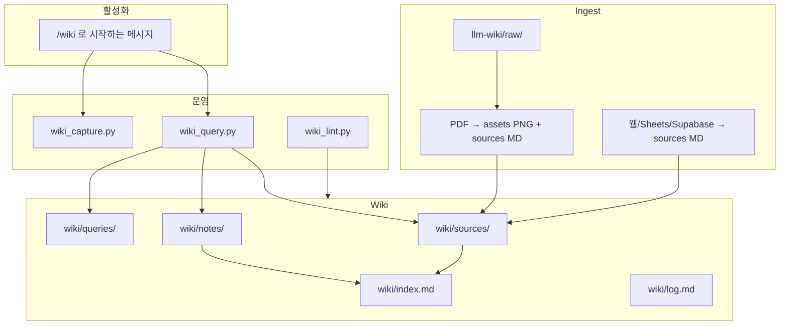

# LLM Wiki 전체 재현 스펙

이 문서 하나만으로 **LLM Wiki 파이프라인 + Cursor 규칙 + 현재 저장된 위키 내용**을
다른 AI/환경에서 **동일하게** 재구축할 수 있도록 압축한 핸드오프 문서입니다.

---

## 1. 다른 AI용 빠른 재현 순서

1. 저장소 루트에 `llm-wiki/` 폴더 생성
2. `.cursor/rules/llm-wiki.mdc` 생성 (§8)
3. `llm-wiki/AGENTS.md` 생성 (§8)
4. `llm-wiki/scripts/` 아래 Python·bat 파일 전부 생성 (§7)
5. `llm-wiki/wiki/` 디렉터리 구조 생성:
   - `sources/`, `notes/`, `queries/`, `concepts/`, `maintenance/lint/`
   - `raw/` (원본·JSON·PDF·assets)
6. `wiki/index.md`, `wiki/log.md`, 템플릿 3개 생성 (§9)
7. `wiki/sources/` 두 소스 MD 생성 (§10) — 또는 §11 스크립트로 재수집
8. `pip install pymupdf` (PDF ingest용)
9. 검증: `python llm-wiki/scripts/wiki_lint.py`

---

## 2. 아키텍처 (4기둥)



### 핵심 정책

| 정책 | 내용 |
|------|------|
| **활성화** | 사용자 메시지가 **`/wiki`로 시작**할 때만 위키 모드. `@llm-wiki`만으로는 **비활성** |
| **단일 위키** | 모든 지식은 `llm-wiki/wiki/` 아래만 |
| **답변 근거** | `wiki/sources/` + `wiki/notes/` (raw PDF 직접 읽기 X, 기본) |
| **로그** | `wiki/log.md` append-only (`ingest` / `query` / `lint` / `note`) |

---

## 3. 디렉터리 트리 (목표 상태)

```
AgentMEMO-main/
├── .cursor/rules/llm-wiki.mdc
└── llm-wiki/
    ├── AGENTS.md
    ├── LLM_WIKI_REBUILD_SPEC.md          # 이 문서
    ├── raw/
    │   ├── pkmnchamps-garchomp-445-samples.json
    │   ├── pokemon-party-mega-list.csv
    │   ├── pokemon-party-mega-list.json
    │   ├── *.pdf                         # (선택) CSE3308 교재
    │   └── assets/<slug>/pages/*.png     # PDF ingest 시
    ├── scripts/
    │   ├── extract_pdf_assets.py
    │   ├── ingest_core.py
    │   ├── ingest_raw.py
    │   ├── ingest_pdfs.py
    │   ├── ingest_pkmnchamps_samples.py
    │   ├── ingest_google_sheet_pokemon.py
    │   ├── wiki_search.py
    │   ├── wiki_query.py
    │   ├── wiki_capture.py
    │   ├── wiki_lint.py
    │   └── *.bat
    └── wiki/
        ├── index.md
        ├── log.md
        ├── sources/
        │   ├── pkmnchamps-garchomp-445-samples.md
        │   └── pokemon-party-mega-list.md
        ├── notes/_template.md
        ├── queries/_template.md
        ├── concepts/                     # (비어 있음)
        └── maintenance/lint/_template.md
```

---

## 4. 의존성

```bash
pip install pymupdf
```

- PDF ingest: **pymupdf** (`fitz`)
- 나머지: Python 3.10+ **stdlib만** (urllib, csv, pathlib 등)
- Playwright 등은 **불필요** (웹 ingest는 Supabase/Sheets CSV 직접 호출)

---

## 5. CLI 요약

| 명령 | 용도 |
|------|------|
| `python llm-wiki/scripts/ingest_raw.py` | `raw/*.pdf` → assets + sources MD |
| `python llm-wiki/scripts/ingest_raw.py --watch` | raw 폴더 감시 |
| `llm-wiki/scripts/sync-from-wii.bat` | OneDrive `wii` PDF → raw + wiki |
| `python llm-wiki/scripts/wiki_query.py "질문"` | sources+notes 검색, queries/ 기록 |
| `python llm-wiki/scripts/wiki_capture.py --title ... --text ...` | notes/ 저장 |
| `python llm-wiki/scripts/wiki_lint.py` | 위키 건강검사 |
| `python llm-wiki/scripts/ingest_pkmnchamps_samples.py` | 한카리아스 상위 8 샘플 |
| `python llm-wiki/scripts/ingest_google_sheet_pokemon.py` | 포켓몬 파티·메가 시트 |

---

## 6. 외부 데이터 소스 & 재수집

### 6.1 PkmnChamps 한카리아스 (상위 8)

- URL: https://pkmnchamps.com/pokedex/445
- API: Supabase REST `pokemon_samples`
  - `pokemon_id=eq.445`, `is_public=eq.true`, `copied_from=is.null`
  - `order=view_count.desc,created_at.desc`, `limit=8`
- 필드: `move_slots`, `sps`, `mega_form`, `nature`, `ability`, `item`, `view_count`

### 6.2 Google Sheets 포켓몬 목록

- URL: https://docs.google.com/spreadsheets/d/1cwn7jw9pM4Di1D8fXUVCcjhbJtPiFzhrB4nofJrbyhw/
- CSV: `.../export?format=csv&gid=0`
- A열=이름, B열=0(6마리 파티) / 1(1인 슬롯·메가)
- **로컬 보정:** `메가엘레이드` B=0 오타 → **B=1** (`SLOT_FIXES` in script)
- **예외:** `플라엣테 (영원의 꽃)` = B=1, 메가 아님

### 6.3 PDF (CSE3308, 선택)

- OneDrive: `C:\Users\dongj\OneDrive\Desktop\wii`
- 9개 PDF ingest 시 `SOURCE_NAMES` 매핑 사용 (`ingest_core.py`)

---

## 7. 스크립트 전체 (복사하여 생성)

### `llm-wiki/scripts/extract_pdf_assets.py`

```python
#!/usr/bin/env python3
"""Extract PDF pages as PNG into llm-wiki/raw/assets/<slug>/pages/."""

from __future__ import annotations

import argparse
import re
import sys
from pathlib import Path

try:
    import fitz
except ImportError:
    print("pip install pymupdf", file=sys.stderr)
    sys.exit(1)


def slugify(name: str) -> str:
    s = re.sub(r"\.pdf$", "", name, flags=re.I)
    s = re.sub(r"^\d+\.\s*", "", s)
    s = s.lower()
    s = re.sub(r"[^a-z0-9]+", "-", s)
    return s.strip("-") or "pdf"


def extract(pdf_path: Path, out_dir: Path, dpi: int = 150) -> int:
    out_dir.mkdir(parents=True, exist_ok=True)
    pages_dir = out_dir / "pages"
    pages_dir.mkdir(exist_ok=True)
    doc = fitz.open(pdf_path)
    matrix = fitz.Matrix(dpi / 72, dpi / 72)
    for i, page in enumerate(doc):
        pix = page.get_pixmap(matrix=matrix, alpha=False)
        pix.save(str(pages_dir / f"page-{i + 1:02d}.png"))
    n = len(doc)
    doc.close()
    return n


def main() -> None:
    p = argparse.ArgumentParser()
    p.add_argument("pdf", type=Path)
    p.add_argument("--assets-root", type=Path, required=True)
    p.add_argument("--dpi", type=int, default=150)
    args = p.parse_args()
    slug = slugify(args.pdf.name)
    out = args.assets_root / slug
    n = extract(args.pdf, out, dpi=args.dpi)
    print(f"{slug}\t{n}")


if __name__ == "__main__":
    main()
```

### `llm-wiki/scripts/ingest_core.py`

```python
"""Shared PDF → wiki/sources ingest logic."""

from __future__ import annotations

import re
import shutil
from dataclasses import dataclass
from datetime import date
from pathlib import Path

try:
    import fitz
except ImportError:
    fitz = None  # type: ignore

from extract_pdf_assets import extract, slugify

SOURCE_NAMES = {
    "vibe-coding-and-agent-coding": "vibe-coding-and-agent-coding",
    "1-vibe-coding-and-agent-coding": "vibe-coding-and-agent-coding",
    "sdlc-pipeline-in-vibe-coding": "sdlc-pipeline-in-vibe-coding",
    "2-sdlc-pipeline-in-vibe-coding": "sdlc-pipeline-in-vibe-coding",
    "agents-subprocess-calling": "agents-subprocess-calling",
    "3-agents-subprocess-calling": "agents-subprocess-calling",
    "plan-mode-sequential-and-parallel-agents": "plan-mode-sequential-and-parallel-agents",
    "4-plan-mode-sequential-and-parallel-agents": "plan-mode-sequential-and-parallel-agents",
    "agent-specifications": "agent-specifications",
    "5-agent-specifications": "agent-specifications",
    "agent-pool-and-orchestrator": "agent-pool-and-orchestrator",
    "6-agent-pool-and-orchestrator": "agent-pool-and-orchestrator",
    "harness-and-skills": "harness-and-skills",
    "7-harness-and-skills": "harness-and-skills",
    "model-context-protocol": "model-context-protocol",
    "8-model-context-protocol": "model-context-protocol",
    "loop-and-hooks": "loop-and-hooks",
    "9-loop-and-hooks": "loop-and-hooks",
}


@dataclass
class IngestResult:
    pdf_name: str
    wiki_name: str
    pages: int
    skipped: bool = False


def wiki_name_for_slug(slug: str) -> str:
    return SOURCE_NAMES.get(slug, slug)


def _fix_korean_spacing(text: str) -> str:
    if not text or re.search(r"[가-힣]\s+[가-힣]", text):
        return text.strip()
    return text.strip()


def page_title(text: str, page_num: int) -> str:
    lines = [ln.strip() for ln in text.splitlines() if ln.strip()]
    skip = re.compile(r"CSE3308|Practical Session|LLM-based", re.I)
    for ln in lines:
        if skip.search(ln):
            continue
        if len(ln) > 3 and len(ln) < 120:
            return ln
    return f"Slide {page_num}"


def extract_page_texts(pdf_path: Path) -> list[tuple[int, str]]:
    if fitz is None:
        raise RuntimeError("pip install pymupdf")
    doc = fitz.open(pdf_path)
    pages = [(i + 1, _fix_korean_spacing(page.get_text())) for i, page in enumerate(doc)]
    doc.close()
    return pages


def build_source_md(
    pdf_name: str,
    assets_slug: str,
    pages: list[tuple[int, str]],
    *,
    synced_from: str,
) -> str:
    today = date.today().isoformat()
    raw_link = f"../../raw/{pdf_name}"
    lines = [
        "---",
        f'title: "{pdf_name.replace(".pdf", "")}"',
        f'source_raw: "../../raw/{pdf_name}"',
        f'assets_slug: "{assets_slug}"',
        "tags: [cse3308, pdf-ingest]",
        f"updated: {today}",
        f"pages: {len(pages)}",
        f"synced_from: {synced_from}",
        "---",
        "",
        f"# {pdf_name.replace('.pdf', '')}",
        "",
        f"**원본:** [`{pdf_name}`](<{raw_link}>)  ",
        f"**슬라이드 이미지:** [`pages/`](../../raw/assets/{assets_slug}/pages/) ({len(pages)}장)  ",
        f"**파이프라인:** `{synced_from}`",
        "",
        "---",
        "",
    ]
    for num, text in pages:
        title = page_title(text, num)
        img = f"../../raw/assets/{assets_slug}/pages/page-{num:02d}.png"
        lines.append(f"### Page {num} — {title}")
        lines.append("")
        lines.append(f"")
        lines.append("")
        if text.strip():
            lines.append("#### 추출 텍스트")
            lines.append("")
            for para in re.split(r"\n{2,}", text.strip()):
                para = para.strip()
                if para:
                    lines.append(para)
                    lines.append("")
        else:
            lines.append("_이 페이지는 추출 텍스트가 거의 없습니다. 위 이미지를 참고하세요._")
            lines.append("")
        lines.append("---")
        lines.append("")
    return "\n".join(lines).rstrip() + "\n"


def ingest_one_pdf(
    pdf_path: Path,
    *,
    root: Path,
    dpi: int = 150,
    synced_from: str = "llm-wiki/raw pipeline",
    copy_into_raw: Path | None = None,
) -> IngestResult:
    """Process one PDF into assets + wiki/sources."""
    root = root.resolve()
    raw_dir = root / "raw"
    assets_root = raw_dir / "assets"
    sources_dir = root / "wiki" / "sources"

    raw_dir.mkdir(parents=True, exist_ok=True)
    sources_dir.mkdir(parents=True, exist_ok=True)

    if copy_into_raw is not None:
        dest = copy_into_raw / pdf_path.name
        shutil.copy2(pdf_path, dest)
        work_pdf = dest
    else:
        work_pdf = pdf_path.resolve()

    slug = slugify(work_pdf.name)
    wiki_name = wiki_name_for_slug(slug)
    assets_slug = slug

    extract(work_pdf, assets_root / assets_slug, dpi=dpi)
    pages = extract_page_texts(work_pdf)
    md = build_source_md(work_pdf.name, assets_slug, pages, synced_from=synced_from)
    (sources_dir / f"{wiki_name}.md").write_text(md, encoding="utf-8")

    return IngestResult(work_pdf.name, wiki_name, len(pages))


def needs_reingest(pdf: Path, root: Path, wiki_name: str, slug: str) -> bool:
    """True if PDF is new or newer than wiki output."""
    sources_md = root / "wiki" / "sources" / f"{wiki_name}.md"
    pages_dir = root / "raw" / "assets" / slug / "pages"
    if not sources_md.is_file():
        return True
    if pdf.stat().st_mtime > sources_md.stat().st_mtime:
        return True
    if not pages_dir.is_dir() or not any(pages_dir.glob("*.png")):
        return True
    return False


def list_raw_pdfs(raw_dir: Path) -> list[Path]:
    return sorted(p for p in raw_dir.glob("*.pdf") if p.is_file())


def rebuild_sources_index(wiki_root: Path, raw_dir: Path) -> None:
    """Rebuild index.md sources section from all sources/*.md."""
    sources_dir = wiki_root / "sources"
    entries: list[tuple[str, str, int]] = []
    for md in sorted(sources_dir.glob("*.md")):
        if md.name.startswith("_"):
            continue
        wiki_name = md.stem
        text = md.read_text(encoding="utf-8")
        m_pages = re.search(r"^pages:\s*(\d+)", text, re.M)
        n = int(m_pages.group(1)) if m_pages else 0
        m_raw = re.search(r'^source_raw:\s*"(.+?)"', text, re.M)
        pdf_name = Path(m_raw.group(1)).name if m_raw else f"{wiki_name}.pdf"
        if not (raw_dir / pdf_name).is_file():
            for c in raw_dir.glob("*.pdf"):
                if slugify(c.name) == wiki_name or wiki_name in slugify(c.name):
                    pdf_name = c.name
                    break
        entries.append((wiki_name, pdf_name, n))

    index_path = wiki_root / "index.md"
    block = ["## 소스 (`sources/`) — PDF→MD", ""]
    for wiki_name, pdf_name, n in entries:
        block.append(
            f"- [{wiki_name.replace('-', ' ').title()}](sources/{wiki_name}.md) — "
            f"`{pdf_name}` ({n}p)"
        )
    block.append("")

    if index_path.exists():
        content = index_path.read_text(encoding="utf-8")
        marker = "## 소스 (`sources/`) — PDF→MD"
        if marker in content:
            start = content.index(marker)
            end = content.find("\n## ", start + 1)
            if end == -1:
                end = len(content)
            content = content[:start] + "\n".join(block) + content[end:]
        else:
            content = content.rstrip() + "\n\n" + "\n".join(block)
    else:
        content = "# LLM Wiki\n\n" + "\n".join(block)
    index_path.write_text(content, encoding="utf-8")


def append_log(wiki_root: Path, msg: str) -> None:
    log = wiki_root / "log.md"
    line = f"## [{date.today().isoformat()}] ingest | {msg}"
    text = log.read_text(encoding="utf-8") if log.is_file() else "# log\n\n"
    if line not in text:
        log.write_text(text.rstrip() + "\n\n" + line + "\n", encoding="utf-8")
```

### `llm-wiki/scripts/ingest_raw.py`

```python
#!/usr/bin/env python3
"""
Raw folder ingest pipeline: PDF in llm-wiki/raw/ → assets + wiki/sources/*.md

Usage:
  python ingest_raw.py              # process new/changed PDFs in raw/
  python ingest_raw.py --force      # re-ingest all PDFs in raw/
  python ingest_raw.py --watch      # poll raw/ every N seconds
  python ingest_raw.py --watch --interval 10
"""

from __future__ import annotations

import argparse
import sys
import time
from pathlib import Path

from extract_pdf_assets import slugify
from ingest_core import (
    append_log,
    ingest_one_pdf,
    list_raw_pdfs,
    needs_reingest,
    rebuild_sources_index,
    wiki_name_for_slug,
)
def _root() -> Path:
    return Path(__file__).resolve().parent.parent


def run_pipeline(root: Path, *, force: bool, dpi: int) -> int:
    raw_dir = root / "raw"
    wiki_root = root / "wiki"
    raw_dir.mkdir(parents=True, exist_ok=True)

    pdfs = list_raw_pdfs(raw_dir)
    if not pdfs:
        print(f"No PDFs in {raw_dir} — drop files into raw/ and run again.")
        return 0

    processed = 0
    skipped = 0

    for pdf in pdfs:
        slug = slugify(pdf.name)
        wiki_name = wiki_name_for_slug(slug)
        if not force and not needs_reingest(pdf, root, wiki_name, slug):
            print(f"skip (up-to-date): {pdf.name}")
            skipped += 1
            continue
        print(f"ingest: {pdf.name}")
        ingest_one_pdf(
            pdf,
            root=root,
            dpi=dpi,
            synced_from="llm-wiki/raw pipeline",
            copy_into_raw=None,
        )
        processed += 1

    rebuild_sources_index(wiki_root, raw_dir)
    if processed:
        append_log(wiki_root, f"raw pipeline: {processed} PDF(s) → sources/*.md + assets")
        print(f"Done: {processed} ingested, {skipped} skipped.")
    else:
        print(f"Nothing to do ({skipped} already up-to-date).")
    return 0


def watch_loop(root: Path, interval: float, force: bool, dpi: int) -> None:
    print(f"Watching {root / 'raw'} every {interval}s (Ctrl+C to stop)")
    while True:
        run_pipeline(root, force=force, dpi=dpi)
        time.sleep(interval)


def main() -> int:
    ap = argparse.ArgumentParser(description="Ingest PDFs from llm-wiki/raw/ into wiki")
    ap.add_argument("--llm-wiki", type=Path, default=_root())
    ap.add_argument("--force", action="store_true", help="Re-ingest all PDFs")
    ap.add_argument("--watch", action="store_true", help="Poll raw/ for new/changed PDFs")
    ap.add_argument("--interval", type=float, default=30.0, help="Watch poll interval (seconds)")
    ap.add_argument("--dpi", type=int, default=150)
    args = ap.parse_args()

    root = args.llm_wiki.resolve()
    try:
        if args.watch:
            watch_loop(root, args.interval, args.force, args.dpi)
            return 0
        return run_pipeline(root, force=args.force, dpi=args.dpi)
    except KeyboardInterrupt:
        print("\nStopped.")
        return 0
    except RuntimeError as e:
        print(e, file=sys.stderr)
        return 1


if __name__ == "__main__":
    sys.exit(main())
```

### `llm-wiki/scripts/ingest_pdfs.py`

```python
#!/usr/bin/env python3
"""
Sync PDFs from external folder → llm-wiki/raw, then wiki (via ingest_core).

Usage:
  python ingest_pdfs.py "C:\\Users\\...\\wii"
"""

from __future__ import annotations

import argparse
import sys
from pathlib import Path

from ingest_core import (
    append_log,
    ingest_one_pdf,
    rebuild_sources_index,
)


def main() -> int:
    ap = argparse.ArgumentParser()
    ap.add_argument("source_dir", type=Path, help="Folder with PDFs (e.g. OneDrive wii)")
    ap.add_argument(
        "--llm-wiki",
        type=Path,
        default=Path(__file__).resolve().parent.parent,
    )
    ap.add_argument("--dpi", type=int, default=150)
    args = ap.parse_args()

    src_dir = args.source_dir.resolve()
    root = args.llm_wiki.resolve()
    raw_dir = root / "raw"
    wiki_root = root / "wiki"

    pdfs = sorted(src_dir.glob("*.pdf"))
    if not pdfs:
        print(f"No PDFs in {src_dir}", file=sys.stderr)
        return 1

    for pdf in pdfs:
        print(f"sync + ingest: {pdf.name}")
        ingest_one_pdf(
            pdf,
            root=root,
            dpi=args.dpi,
            synced_from="OneDrive/Desktop/wii",
            copy_into_raw=raw_dir,
        )

    rebuild_sources_index(wiki_root, raw_dir)
    append_log(wiki_root, f"external → raw: {len(pdfs)} PDFs, sources/*.md + assets")
    print(f"Done: {len(pdfs)} PDFs ingested.")
    return 0


if __name__ == "__main__":
    try:
        sys.exit(main())
    except RuntimeError as e:
        print(e, file=sys.stderr)
        sys.exit(1)
```

### `llm-wiki/scripts/ingest_pkmnchamps_samples.py`

```python
#!/usr/bin/env python3
"""Fetch Garchomp (445) public samples from pkmnchamps Supabase and save to wiki."""
import json
import urllib.parse
import urllib.request
from datetime import date
from pathlib import Path

SUPABASE = "https://misabaliuftjkqigysvv.supabase.co"
ANON_KEY = (
    "eyJhbGciOiJIUzI1NiIsInR5cCI6IkpXVCJ9."
    "eyJpc3MiOiJzdXBhYmFzZSIsInJlZiI6Im1pc2FiYWxpdWZ0amtxaWd5c3Z2Iiwicm9sZSI6ImFub24iLCJpYXQiOjE3NzQ3NjczMjIsImV4cCI6MjA5MDM0MzMyMn0."
    "0HXY6wd5czlPCyyzWGYfkDlJkZLryDA3Arc544t9Ges"
)
POKEMON_ID = 445
TOP_N = 8
SOURCE_URL = "https://pkmnchamps.com/pokedex/445"
ROOT = Path(__file__).resolve().parent.parent
WIKI = ROOT / "wiki"
RAW = ROOT / "raw"


def supabase_get(table: str, params: dict) -> list:
    q = urllib.parse.urlencode(params, safe="*,()")
    url = f"{SUPABASE}/rest/v1/{table}?{q}"
    req = urllib.request.Request(
        url,
        headers={
            "apikey": ANON_KEY,
            "Authorization": f"Bearer {ANON_KEY}",
            "Accept": "application/json",
        },
    )
    with urllib.request.urlopen(req, timeout=30) as r:
        return json.loads(r.read().decode("utf-8"))


def fetch_top_samples(limit: int = TOP_N) -> list[dict]:
    params = {
        "select": "*",
        "pokemon_id": f"eq.{POKEMON_ID}",
        "is_public": "eq.true",
        "copied_from": "is.null",
        "order": "view_count.desc,created_at.desc",
        "limit": str(limit),
    }
    return supabase_get("pokemon_samples", params)


def fmt_sample(s: dict, i: int) -> str:
    moves = s.get("move_slots") or s.get("moves") or []
    if isinstance(moves, str):
        try:
            moves = json.loads(moves)
        except json.JSONDecodeError:
            moves = [moves]
    moves = [m for m in moves if m]

    sps = s.get("sps") or s.get("evs") or s.get("ev_spread") or {}
    if isinstance(sps, str):
        try:
            sps = json.loads(sps)
        except json.JSONDecodeError:
            sps = {}

    form = s.get("mega_form") or s.get("form") or s.get("pokemon_form") or "기본"

    lines = [
        f"### 샘플 {i}",
        "",
        f"- **순위:** {i} (조회수 {s.get('view_count', 0)})",
        f"- **이름/제목:** {s.get('title') or s.get('name') or '(제목 없음)'}",
        f"- **폼:** {form}",
        f"- **레벨:** {s.get('level') or '-'}",
        f"- **성격:** {s.get('nature') or '-'}",
        f"- **특성:** {s.get('ability') or '-'}",
        f"- **도구:** {s.get('item') or '-'}",
    ]
    if sps:
        lines.append(f"- **배율(sps):** `{json.dumps(sps, ensure_ascii=False)}`")
    if moves:
        lines.append("- **기술:**")
        for m in moves:
            lines.append(f"  - {m}")
    note = s.get("description") or s.get("memo") or s.get("comment")
    if note:
        lines.append(f"- **메모:** {note}")
    lines.append("")
    return "\n".join(lines)


def build_md(samples: list[dict]) -> str:
    today = date.today().isoformat()
    body = [
        "---",
        'title: "한카리아스 상위 샘플 8 (pkmnchamps #445)"',
        f"source_url: {SOURCE_URL}",
        "pokemon_id: 445",
        "pokemon_name: 한카리아스",
        f"sample_count: {len(samples)}",
        "selection: view_count.desc 상위 8",
        f"updated: {today}",
        "tags: [pkmnchamps, sample, garchomp]",
        "---",
        "",
        "# 한카리아스 상위 샘플 (PkmnChamps)",
        "",
        f"**출처:** [{SOURCE_URL}]({SOURCE_URL})  ",
        "**데이터:** PkmnChamps 공개 `pokemon_samples` — **조회수(`view_count`) 상위 8개**  ",
        f"**수집일:** {today}  ",
        f"**샘플 수:** {len(samples)}",
        "",
        "---",
        "",
    ]
    if not samples:
        body.append("_공개 샘플이 없거나 조회에 실패했습니다._")
    else:
        for i, s in enumerate(samples, 1):
            body.append(fmt_sample(s, i))
            body.append("---")
            body.append("")
    return "\n".join(body).rstrip() + "\n"


def update_index(wiki_stem: str) -> None:
    index = WIKI / "index.md"
    text = index.read_text(encoding="utf-8") if index.exists() else "# LLM Wiki\n"
    line = f"- [한카리아스 샘플 (pkmnchamps)](sources/{wiki_stem}.md) — 웹 ingest"
    if line not in text:
        marker = "## 소스 (`sources/`) — PDF→MD"
        if marker in text:
            insert_at = text.find("\n## ", text.index(marker) + 1)
            if insert_at == -1:
                text = text.rstrip() + "\n" + line + "\n"
            else:
                # insert after marker block first bullet or empty
                if "(없음" in text:
                    text = text.replace("- (없음 — `raw/`에 PDF 넣고 `ingest-raw.bat` 실행)", line)
                else:
                    text = text.rstrip() + "\n" + line + "\n"
        else:
            text = text.rstrip() + f"\n\n## 소스\n\n{line}\n"
    index.write_text(text, encoding="utf-8")


def append_log(msg: str) -> None:
    log = WIKI / "log.md"
    line = f"## [{date.today().isoformat()}] ingest | {msg}"
    text = log.read_text(encoding="utf-8") if log.is_file() else "# log\n\n"
    if line not in text:
        log.write_text(text.rstrip() + "\n\n" + line + "\n", encoding="utf-8")


def main() -> None:
    RAW.mkdir(parents=True, exist_ok=True)
    (WIKI / "sources").mkdir(parents=True, exist_ok=True)

    samples = fetch_top_samples()
    raw_path = RAW / "pkmnchamps-garchomp-445-samples.json"
    raw_path.write_text(json.dumps(samples, ensure_ascii=False, indent=2), encoding="utf-8")

    md = build_md(samples)
    out = WIKI / "sources" / "pkmnchamps-garchomp-445-samples.md"
    out.write_text(md, encoding="utf-8")
    update_index(out.stem)
    append_log(
        f"pkmnchamps 한카리아스 상위 샘플 {len(samples)}건 (view_count) "
        f"→ sources/{out.name}"
    )
    print(f"samples={len(samples)} -> {out}")


if __name__ == "__main__":
    main()
```

### `llm-wiki/scripts/ingest_google_sheet_pokemon.py`

```python
#!/usr/bin/env python3
"""Ingest public Google Sheet: Pokémon party list + mega (1-slot) flags."""
import csv
import io
import json
import urllib.request
from datetime import date
from pathlib import Path

SHEET_ID = "1cwn7jw9pM4Di1D8fXUVCcjhbJtPiFzhrB4nofJrbyhw"
GID = "0"
SOURCE_URL = (
    f"https://docs.google.com/spreadsheets/d/{SHEET_ID}/edit?hl=ko&gid={GID}#gid={GID}"
)
EXPORT_URL = (
    f"https://docs.google.com/spreadsheets/d/{SHEET_ID}/export?format=csv&gid={GID}"
)
ROOT = Path(__file__).resolve().parent.parent
WIKI = ROOT / "wiki"
RAW = ROOT / "raw"
STEM = "pokemon-party-mega-list"

# 스프레드시트 오타 보정 (원본 B값 → 수정 B값)
SLOT_FIXES: dict[str, str] = {
    "메가엘레이드": "1",
}


def row_from_name_slot(name: str, slot: str) -> dict:
    if name in SLOT_FIXES:
        slot = SLOT_FIXES[name]
    return {
        "name": name,
        "slot": slot,
        "is_one_slot": slot == "1",
        "is_six_party": slot == "0",
        "is_mega_named": name.startswith("메가"),
        "slot_corrected": name in SLOT_FIXES,
    }


def fetch_rows() -> list[dict]:
    with urllib.request.urlopen(EXPORT_URL, timeout=30) as r:
        csv_text = r.read().decode("utf-8")
    RAW.mkdir(parents=True, exist_ok=True)
    (RAW / f"{STEM}.csv").write_text(csv_text, encoding="utf-8")

    rows: list[dict] = []
    for row in csv.reader(io.StringIO(csv_text)):
        if not row or not row[0].strip():
            continue
        name = row[0].strip()
        slot = row[1].strip() if len(row) > 1 else ""
        rows.append(row_from_name_slot(name, slot))
    (RAW / f"{STEM}.json").write_text(
        json.dumps(rows, ensure_ascii=False, indent=2), encoding="utf-8"
    )
    return rows


def build_md(rows: list[dict]) -> str:
    today = date.today().isoformat()
    one_slot = [r for r in rows if r["is_one_slot"]]
    six_party = [r for r in rows if r["is_six_party"]]
    mega_named = [r["name"] for r in rows if r["is_mega_named"]]
    mega_one_slot = [r["name"] for r in one_slot if r["is_mega_named"]]
    mega_six_party = [r["name"] for r in six_party if r["is_mega_named"]]
    one_slot_other = [r["name"] for r in one_slot if not r["is_mega_named"]]
    corrected = [r["name"] for r in rows if r.get("slot_corrected")]

    lines = [
        "---",
        'title: "포켓몬 파티·메가진화 목록 (Google Sheets)"',
        f"source_url: {SOURCE_URL}",
        f"pokemon_count: {len(rows)}",
        f"one_slot_count: {len(one_slot)}",
        f"six_party_count: {len(six_party)}",
        f"mega_named_count: {len(mega_named)}",
        f"mega_one_slot_count: {len(mega_one_slot)}",
        f"updated: {today}",
        "tags: [pokemon, google-sheets, mega-evolution, party]",
        "---",
        "",
        "# 포켓몬 파티·메가진화 목록",
        "",
        f"**출처:** [{SOURCE_URL}]({SOURCE_URL})  ",
        f"**수집일:** {today}  ",
        f"**총 포켓몬 수:** {len(rows)}",
        "",
        "## 컬럼 의미",
        "",
        "| 컬럼 | 의미 |",
        "|------|------|",
        "| A | 포켓몬 이름 |",
        "| B = `0` | **6마리 파티** 구성용 포켓몬 |",
        "| B = `1` | **1인 슬롯** 포켓몬 (대부분 메가진화) |",
        "",
        "## 요약",
        "",
        f"- **6마리 파티용 (B=0):** {len(six_party)}마리",
        f"- **1인 슬롯 (B=1):** {len(one_slot)}마리",
        f"- **이름이 `메가`로 시작 (전체):** {len(mega_named)}마리",
        f"- **1인 슬롯이면서 `메가` 이름:** {len(mega_one_slot)}마리",
        "",
        "B=1은 1인 슬롯 포켓몬을 뜻하며, 스프레드시트 기준으로는 거의 전부 메가진화 포켓몬입니다.",
        f"예외 (B=1, 메가 아님): {', '.join(one_slot_other) if one_slot_other else '(없음)'}.",
    ]
    if corrected:
        fixes = ", ".join(f"{n} → B={SLOT_FIXES[n]}" for n in corrected)
        lines.append(f"로컬 보정 (스프레드시트 오타): {fixes}.")
    if mega_six_party:
        lines.append(
            f"참고 (B=0, 메가 이름): {', '.join(mega_six_party)} — 6마리 파티 목록에 있지만 이름은 메가."
        )
    lines.extend(
        [
            "",
            "---",
            "",
            "## 메가진화 포켓몬 (이름 `메가` 접두, 1인 슬롯 B=1)",
            "",
        ]
    )
    for i, name in enumerate(mega_one_slot, 1):
        lines.append(f"{i}. {name}")

    if mega_six_party:
        lines.extend(
            [
                "",
                "---",
                "",
                "## 메가 이름이지만 6마리 파티 (B=0)",
                "",
            ]
        )
        for i, name in enumerate(mega_six_party, 1):
            lines.append(f"{i}. {name}")

    if one_slot_other:
        lines.extend(
            [
                "",
                "---",
                "",
                "## 1인 슬롯이지만 메가가 아닌 포켓몬 (B=1)",
                "",
            ]
        )
        for i, name in enumerate(one_slot_other, 1):
            lines.append(f"{i}. {name}")

    lines.extend(
        [
            "",
            "---",
            "",
            "## 6마리 파티용 포켓몬 (B=0)",
            "",
        ]
    )
    for i, r in enumerate(six_party, 1):
        lines.append(f"{i}. {r['name']}")

    lines.extend(
        [
            "",
            "---",
            "",
            "## 전체 목록 (원본 순서)",
            "",
            "| # | 포켓몬 | B | 구분 |",
            "|---|--------|---|------|",
        ]
    )
    for i, r in enumerate(rows, 1):
        kind = "1인 슬롯" if r["is_one_slot"] else "6마리 파티"
        if r["is_mega_named"]:
            kind += " · 메가"
        if r.get("slot_corrected"):
            kind += " · 보정"
        lines.append(f"| {i} | {r['name']} | {r['slot']} | {kind} |")

    lines.append("")
    return "\n".join(lines)


def update_index(stem: str) -> None:
    index = WIKI / "index.md"
    text = index.read_text(encoding="utf-8") if index.exists() else "# LLM Wiki\n"
    line = f"- [포켓몬 파티·메가 목록 (Google Sheets)](sources/{stem}.md) — 웹 ingest"
    if line not in text:
        marker = "## 소스 (`sources/`) — PDF→MD"
        if marker in text:
            insert = text.find(marker) + len(marker)
            text = text[:insert] + "\n\n" + line + text[insert:]
        else:
            text = text.rstrip() + f"\n\n## 소스\n\n{line}\n"
    index.write_text(text, encoding="utf-8")


def append_log(msg: str) -> None:
    log = WIKI / "log.md"
    line = f"## [{date.today().isoformat()}] ingest | {msg}"
    text = log.read_text(encoding="utf-8") if log.is_file() else "# log\n\n"
    if line not in text:
        log.write_text(text.rstrip() + "\n\n" + line + "\n", encoding="utf-8")


def main() -> None:
    (WIKI / "sources").mkdir(parents=True, exist_ok=True)
    rows = fetch_rows()
    out = WIKI / "sources" / f"{STEM}.md"
    out.write_text(build_md(rows), encoding="utf-8")
    update_index(STEM)
    one_slot = sum(1 for r in rows if r["is_one_slot"])
    mega = sum(1 for r in rows if r["is_mega_named"])
    mega_one = sum(1 for r in rows if r["is_mega_named"] and r["is_one_slot"])
    append_log(
        f"Google Sheets 포켓몬 목록 {len(rows)}종 "
        f"(1인슬롯 {one_slot}, 메가·1인슬롯 {mega_one}) "
        f"→ sources/{out.name}"
        + ("; 보정: 메가엘레이드 B=1" if any(r.get("slot_corrected") for r in rows) else "")
    )
    print(f"rows={len(rows)} one_slot={one_slot} mega={mega} mega_one_slot={mega_one} -> {out}")


if __name__ == "__main__":
    main()
```

### `llm-wiki/scripts/wiki_search.py`

```python
"""Local keyword search over llm-wiki markdown (stdlib only)."""

from __future__ import annotations

import re
from dataclasses import dataclass
from pathlib import Path


@dataclass
class WikiChunk:
    path: Path
    rel_path: str
    heading: str
    text: str
    score: float


_TOKEN_RE = re.compile(r"[\w가-힣]+", re.UNICODE)
_SKIP_PARTS = {"queries", "maintenance", ".git"}

# 검색 범위: PDF→MD는 sources/; 대화에서 남긴 것은 notes/
SCOPE_SOURCES = "sources"
SCOPE_NOTES = "notes"
SCOPE_KNOWLEDGE = "knowledge"  # sources + notes (기본 질의)
SCOPE_ALL = "all"


def tokenize(text: str) -> list[str]:
    return [t.lower() for t in _TOKEN_RE.findall(text) if len(t) > 1]


def slugify(text: str, max_len: int = 48) -> str:
    s = text.lower()
    s = re.sub(r"[^a-z0-9가-힣]+", "-", s, flags=re.UNICODE)
    s = re.sub(r"-+", "-", s).strip("-")
    return (s[:max_len] or "query").rstrip("-")


def _should_index(path: Path, wiki_root: Path, scope: str) -> bool:
    if path.name.startswith("_"):
        return False
    if path.suffix.lower() != ".md":
        return False
    parts = set(path.relative_to(wiki_root).parts)
    if parts & _SKIP_PARTS:
        return False
    if scope == SCOPE_SOURCES:
        return "sources" in parts
    if scope == SCOPE_NOTES:
        return "notes" in parts
    if scope == SCOPE_KNOWLEDGE:
        return bool(parts & {"sources", "notes"})
    return True


def iter_wiki_files(wiki_root: Path, scope: str = SCOPE_KNOWLEDGE) -> list[Path]:
    files: list[Path] = []
    for p in wiki_root.rglob("*.md"):
        if _should_index(p, wiki_root, scope):
            files.append(p)
    return sorted(files)


def split_sections(content: str) -> list[tuple[str, str]]:
    """Split by ## headings; preamble is heading ''."""
    parts = re.split(r"(?m)^##\s+", content)
    if not parts:
        return [("", content)]
    sections: list[tuple[str, str]] = []
    preamble = parts[0].strip()
    if preamble:
        sections.append(("", preamble))
    for block in parts[1:]:
        lines = block.split("\n", 1)
        title = lines[0].strip()
        body = lines[1].strip() if len(lines) > 1 else ""
        sections.append((title, body))
    return sections or [("", content)]


def score_chunk(query_tokens: list[str], heading: str, body: str, rel_path: str) -> float:
    if not query_tokens:
        return 0.0
    hay = f"{rel_path} {heading} {body}".lower()
    hay_tokens = set(tokenize(hay))
    qset = set(query_tokens)
    overlap = qset & hay_tokens
    if not overlap:
        return 0.0
    score = len(overlap) / len(qset)
    # title / path boost
    path_lower = rel_path.lower()
    for t in query_tokens:
        if t in path_lower:
            score += 0.35
        if t in heading.lower():
            score += 0.25
    # prefer substantive sections
    score += min(len(body) / 8000, 0.15)
    return score


def search_wiki(
    wiki_root: Path,
    question: str,
    *,
    top_k: int = 8,
    min_score: float = 0.12,
    scope: str = SCOPE_KNOWLEDGE,
) -> list[WikiChunk]:
    query_tokens = tokenize(question)
    if not query_tokens:
        return []

    hits: list[WikiChunk] = []
    for path in iter_wiki_files(wiki_root, scope=scope):
        try:
            content = path.read_text(encoding="utf-8")
        except OSError:
            continue
        rel = path.relative_to(wiki_root).as_posix()
        for heading, body in split_sections(content):
            sc = score_chunk(query_tokens, heading, body, rel)
            if sc < min_score:
                continue
            excerpt = body[:1200] + ("…" if len(body) > 1200 else "")
            hits.append(
                WikiChunk(
                    path=path,
                    rel_path=rel,
                    heading=heading or "(서문)",
                    text=excerpt,
                    score=sc,
                )
            )

    hits.sort(key=lambda c: (-c.score, c.rel_path))
    # dedupe: keep best score per file+heading
    seen: set[tuple[str, str]] = set()
    unique: list[WikiChunk] = []
    for h in hits:
        key = (h.rel_path, h.heading)
        if key in seen:
            continue
        seen.add(key)
        unique.append(h)
        if len(unique) >= top_k:
            break
    return unique
```

### `llm-wiki/scripts/wiki_query.py`

```python
#!/usr/bin/env python3
"""
User Query for LLM Wiki: search wiki MD, write query record, append log.

Usage:
  python wiki_query.py "바이브 코딩이 뭐야?"
  python wiki_query.py "..." --wiki-root ../wiki --top 10
  python wiki_query.py "..." --json
  python wiki_query.py "..." --write-answer answer.txt
"""

from __future__ import annotations

import argparse
import json
import sys
from datetime import datetime
from pathlib import Path

from wiki_search import (
    SCOPE_KNOWLEDGE,
    SCOPE_SOURCES,
    WikiChunk,
    search_wiki,
    slugify,
)


def _llm_wiki_root() -> Path:
    return Path(__file__).resolve().parent.parent


def format_hits_markdown(question: str, hits: list[WikiChunk]) -> str:
    lines = [
        "# 검색된 위키 근거",
        "",
        f"질문 토큰 기준 상위 **{len(hits)}**개 구간 (로컬 키워드 검색).",
        "",
    ]
    if not hits:
        lines.append(
            "_일치하는 구간 없음. `wiki/sources/`(PDF→MD) 또는 `wiki/notes/`(대화 기록)를 확인하세요._"
        )
        return "\n".join(lines)

    for i, h in enumerate(hits, 1):
        lines.append(f"## {i}. `{h.rel_path}` — {h.heading}")
        lines.append(f"- **점수:** {h.score:.2f}")
        lines.append("")
        lines.append(h.text)
        lines.append("")
    return "\n".join(lines)


def build_query_document(
    question: str,
    hits: list[WikiChunk],
    answer: str | None,
    title: str | None,
) -> str:
    now = datetime.now()
    date_str = now.strftime("%Y-%m-%d")
    pages_read = sorted({h.rel_path for h in hits})
    display_title = title or (question[:60] + ("…" if len(question) > 60 else ""))

    fm_pages = json.dumps(pages_read, ensure_ascii=False)
    body_hits = format_hits_markdown(question, hits)

    answer_block = answer.strip() if answer else "_(답변 미작성 — Cursor에서 위 근거를 읽고 아래를 채우거나 `wiki_query.py --write-answer` 사용)_"

    return f"""---
kind: query
date: {date_str}
title: {json.dumps(display_title, ensure_ascii=False)}
pages_read: {fm_pages}
related_synthesis: null
---

# 질문

{question.strip()}

{body_hits}

# 답변 요약

{answer_block}

# 인용·근거

{chr(10).join(f"- [{p}]({p})" for p in pages_read) if pages_read else "- (없음)"}

# 후속

- 
"""


def append_log(wiki_root: Path, title: str, query_filename: str) -> None:
    log_path = wiki_root / "log.md"
    line = f"## [{datetime.now().strftime('%Y-%m-%d')}] query | {title} → `queries/{query_filename}`"
    text = log_path.read_text(encoding="utf-8") if log_path.exists() else "# LLM Wiki — 변경 로그\n\n"
    if line not in text:
        log_path.write_text(text.rstrip() + "\n\n" + line + "\n", encoding="utf-8")


def main() -> int:
    parser = argparse.ArgumentParser(description="LLM Wiki User Query")
    parser.add_argument("question", help="User question")
    parser.add_argument(
        "--wiki-root",
        type=Path,
        default=_llm_wiki_root() / "wiki",
        help="Path to wiki/ directory",
    )
    parser.add_argument("--top", type=int, default=8, help="Max chunks to retrieve")
    parser.add_argument("--no-save", action="store_true", help="Search only, do not write queries/")
    parser.add_argument("--title", type=str, default=None, help="Query record title")
    parser.add_argument("--write-answer", type=Path, default=None, help="File with answer body")
    parser.add_argument("--json", action="store_true", help="Print JSON to stdout")
    parser.add_argument(
        "--scope",
        choices=[SCOPE_KNOWLEDGE, SCOPE_SOURCES, "notes"],
        default=SCOPE_KNOWLEDGE,
        help="sources=PDF MD만, notes=대화 기록만, knowledge=sources+notes (기본)",
    )
    args = parser.parse_args()

    wiki_root = args.wiki_root.resolve()
    if not wiki_root.is_dir():
        print(f"wiki root not found: {wiki_root}", file=sys.stderr)
        return 1

    hits = search_wiki(wiki_root, args.question, top_k=args.top, scope=args.scope)
    answer: str | None = None
    if args.write_answer and args.write_answer.is_file():
        answer = args.write_answer.read_text(encoding="utf-8")

    if args.json:
        payload = {
            "question": args.question,
            "hits": [
                {
                    "path": h.rel_path,
                    "heading": h.heading,
                    "score": round(h.score, 4),
                    "excerpt": h.text,
                }
                for h in hits
            ],
        }
        print(json.dumps(payload, ensure_ascii=False, indent=2))
    else:
        print(format_hits_markdown(args.question, hits))

    if args.no_save:
        return 0

    queries_dir = wiki_root / "queries"
    queries_dir.mkdir(parents=True, exist_ok=True)
    stamp = datetime.now().strftime("%Y-%m-%d_%H%M")
    slug = slugify(args.question)
    filename = f"{stamp}_{slug}.md"
    out_path = queries_dir / filename
    doc = build_query_document(args.question, hits, answer, args.title)
    out_path.write_text(doc, encoding="utf-8")
    append_log(wiki_root, args.title or slug, filename)

    if not args.json:
        print(f"\n---\n저장: {out_path.relative_to(wiki_root.parent)}", file=sys.stderr)
    return 0


if __name__ == "__main__":
    sys.exit(main())
```

### `llm-wiki/scripts/wiki_capture.py`

```python
#!/usr/bin/env python3
"""
Save conversation knowledge to wiki/notes/ for future queries.

Usage:
  python wiki_capture.py --title "LLM Wiki 운영 방침" --text "PDF MD만 sources에..."
  python wiki_capture.py --title "..." --file note_body.md
  type note.txt | python wiki_capture.py --title "..." --stdin
"""

from __future__ import annotations

import argparse
import json
import sys
from datetime import datetime
from pathlib import Path

from wiki_search import slugify


def _llm_wiki_root() -> Path:
    return Path(__file__).resolve().parent.parent


def build_note_document(title: str, body: str, context: str | None, sources: list[str]) -> str:
    date_str = datetime.now().strftime("%Y-%m-%d")
    src_json = json.dumps(sources, ensure_ascii=False)
    ctx_block = context.strip() if context else "_(대화 맥락 미기록)_"

    return f"""---
kind: note
date: {date_str}
title: {json.dumps(title, ensure_ascii=False)}
tags: [llm-wiki, conversation]
sources: {src_json}
---

# 요약

{body.strip()}

# 맥락

{ctx_block}

# 관련 위키

{chr(10).join(f"- [{s}]({s})" for s in sources) if sources else "- (없음)"}
"""


def append_log(wiki_root: Path, title: str, filename: str) -> None:
    log_path = wiki_root / "log.md"
    line = f"## [{datetime.now().strftime('%Y-%m-%d')}] note | {title} → `notes/{filename}`"
    text = log_path.read_text(encoding="utf-8") if log_path.exists() else "# LLM Wiki — 변경 로그\n\n"
    if line not in text:
        log_path.write_text(text.rstrip() + "\n\n" + line + "\n", encoding="utf-8")


def main() -> int:
    parser = argparse.ArgumentParser(description="LLM Wiki — capture conversation to notes/")
    parser.add_argument("--title", required=True, help="Note title")
    parser.add_argument("--text", type=str, default=None, help="Note body (summary)")
    parser.add_argument("--file", type=Path, default=None, help="Read body from file")
    parser.add_argument("--stdin", action="store_true", help="Read body from stdin")
    parser.add_argument("--context", type=str, default=None, help="Why this was captured")
    parser.add_argument(
        "--source",
        action="append",
        default=[],
        help="Related wiki path (repeatable), e.g. sources/foo.md",
    )
    parser.add_argument(
        "--wiki-root",
        type=Path,
        default=_llm_wiki_root() / "wiki",
    )
    args = parser.parse_args()

    if args.text:
        body = args.text
    elif args.file and args.file.is_file():
        body = args.file.read_text(encoding="utf-8")
    elif args.stdin:
        body = sys.stdin.read()
    else:
        print("Provide --text, --file, or --stdin", file=sys.stderr)
        return 1

    if not body.strip():
        print("Empty note body", file=sys.stderr)
        return 1

    wiki_root = args.wiki_root.resolve()
    notes_dir = wiki_root / "notes"
    notes_dir.mkdir(parents=True, exist_ok=True)

    stamp = datetime.now().strftime("%Y-%m-%d")
    slug = slugify(args.title)
    filename = f"{stamp}_{slug}.md"
    out_path = notes_dir / filename

    doc = build_note_document(args.title, body, args.context, args.source)
    out_path.write_text(doc, encoding="utf-8")
    append_log(wiki_root, args.title, filename)

    print(out_path.relative_to(wiki_root.parent))
    return 0


if __name__ == "__main__":
    sys.exit(main())
```

### `llm-wiki/scripts/wiki_lint.py`

```python
#!/usr/bin/env python3
"""
LLM Wiki Maintenance (Lint): health-check wiki MD, write report, append log.

Usage:
  python wiki_lint.py
  python wiki_lint.py --json
  python wiki_lint.py --scope knowledge   # sources+notes+concepts (default)
  python wiki_lint.py --no-save
"""

from __future__ import annotations

import argparse
import json
import re
import sys
from urllib.parse import unquote
from dataclasses import dataclass, field
from datetime import datetime
from pathlib import Path

_LINK_RE = re.compile(r"!?\[([^\]]*)\]\(([^)]+)\)")
_FRONTMATTER_RE = re.compile(r"^---\s*\n.*?\n---\s*\n", re.DOTALL)
_SKIP_DIRS = {"maintenance"}


@dataclass
class Finding:
    kind: str
    location: str
    detail: str
    action: str = ""


@dataclass
class LintReport:
    scope: str
    findings: list[Finding] = field(default_factory=list)

    def add(self, kind: str, location: str, detail: str, action: str = "") -> None:
        self.findings.append(Finding(kind, location, detail, action))


def _llm_wiki_root() -> Path:
    return Path(__file__).resolve().parent.parent


def strip_frontmatter(text: str) -> str:
    return _FRONTMATTER_RE.sub("", text, count=1)


def list_wiki_pages(wiki_root: Path, scope: str) -> list[Path]:
    pages: list[Path] = []
    for p in wiki_root.rglob("*.md"):
        if p.name.startswith("_"):
            continue
        rel_parts = set(p.relative_to(wiki_root).parts)
        if rel_parts & _SKIP_DIRS:
            continue
        if scope == "knowledge":
            if not (rel_parts & {"sources", "notes", "concepts"}):
                continue
        elif scope == "all":
            if "queries" in rel_parts:
                continue
        pages.append(p)
    return sorted(pages)


def list_all_indexed_md(wiki_root: Path) -> list[Path]:
    out: list[Path] = []
    for p in wiki_root.rglob("*.md"):
        if p.name.startswith("_"):
            continue
        parts = p.relative_to(wiki_root).parts
        if parts[0] in _SKIP_DIRS:
            continue
        out.append(p)
    return sorted(out)


def extract_links(content: str, from_file: Path, wiki_root: Path) -> list[tuple[str, Path | None, bool]]:
    """Return (raw, resolved_path or None, is_external) per link."""
    results: list[tuple[str, Path | None, bool]] = []
    for _text, target in _LINK_RE.findall(content):
        target = unquote(target.strip())
        if target.startswith("<") and ">" in target:
            target = target[1 : target.index(">")]
        elif target.startswith("<"):
            target = target.lstrip("<")
        target = target.strip()
        if "?" in target and not target.startswith("<"):
            target = target.split()[0]
        if target.startswith(("http://", "https://", "mailto:")):
            results.append((target, None, True))
            continue
        if target.startswith("#"):
            results.append((target, from_file, False))
            continue
        resolved = (from_file.parent / target).resolve()
        results.append((target, resolved, False))
    return results


def normalize_wiki_ref(path: Path, wiki_root: Path) -> str | None:
    try:
        rel = path.relative_to(wiki_root.resolve())
        if rel.suffix.lower() == ".md":
            return rel.as_posix()
    except ValueError:
        pass
    return None


def collect_inbound_links(wiki_root: Path) -> dict[str, set[str]]:
    """wiki-relative path -> set of files that link to it."""
    inbound: dict[str, set[str]] = {}
    for md in list_all_indexed_md(wiki_root):
        rel_from = md.relative_to(wiki_root).as_posix()
        try:
            content = md.read_text(encoding="utf-8")
        except OSError:
            continue
        for raw, resolved, external in extract_links(content, md, wiki_root):
            if external or resolved is None:
                continue
            if raw.startswith("#"):
                continue
            if not resolved.exists():
                continue
            ref = normalize_wiki_ref(resolved, wiki_root)
            if ref:
                inbound.setdefault(ref, set()).add(rel_from)
    return inbound


def parse_index_links(index_path: Path) -> set[str]:
    if not index_path.is_file():
        return set()
    text = index_path.read_text(encoding="utf-8")
    refs: set[str] = set()
    for _t, target in _LINK_RE.findall(text):
        target = target.strip().split()[0]
        if target.endswith(".md") and not target.startswith("http"):
            refs.add(target.replace("\\", "/"))
    return refs


def run_lint(wiki_root: Path, scope: str) -> LintReport:
    report = LintReport(scope=scope)
    wiki_root = wiki_root.resolve()
    index_path = wiki_root / "index.md"
    inbound = collect_inbound_links(wiki_root)
    index_refs = parse_index_links(index_path)

    knowledge_pages = list_wiki_pages(wiki_root, scope)

    # --- index drift: sources not in index ---
    if index_path.is_file():
        for p in sorted((wiki_root / "sources").glob("*.md")):
            if p.name.startswith("_"):
                continue
            rel = f"sources/{p.name}"
            if rel not in index_refs:
                report.add(
                    "index_drift",
                    rel,
                    "index.md 목차에 링크 없음",
                    f"index.md의 소스 섹션에 [{p.stem}]({rel}) 추가",
                )

    for md in list_all_indexed_md(wiki_root):
        rel = md.relative_to(wiki_root).as_posix()
        try:
            content = md.read_text(encoding="utf-8")
        except OSError as e:
            report.add("read_error", rel, str(e), "파일 인코딩·권한 확인")
            continue

        body = strip_frontmatter(content)

        # --- broken links ---
        for raw, resolved, external in extract_links(content, md, wiki_root):
            if external or raw.startswith("#"):
                continue
            if resolved is None:
                continue
            if resolved.is_dir():
                continue
            if not resolved.exists():
                report.add(
                    "broken_link",
                    rel,
                    f"깨진 링크: `{raw}`",
                    "경로 수정 또는 대상 파일 생성",
                )

        # --- thin page (knowledge only) ---
        if md in knowledge_pages and len(body.strip()) < 150:
            report.add(
                "thin_page",
                rel,
                f"본문이 매우 짧음 ({len(body.strip())}자)",
                "내용 보강 또는 ingest 재실행",
            )

        # --- orphan (sources/notes/concepts) ---
        parts = set(md.relative_to(wiki_root).parts)
        if parts & {"sources", "notes", "concepts"}:
            if rel not in inbound and rel not in index_refs:
                report.add(
                    "orphan",
                    rel,
                    "다른 위키 페이지·index.md에서 링크되지 않음",
                    "index.md 또는 관련 sources/notes에 링크 추가",
                )

        # --- placeholder query answers ---
        if "queries" in parts and "_(답변 미작성" in content:
            report.add(
                "incomplete_query",
                rel,
                "답변 요약이 비어 있음",
                "답변 요약 섹션 작성",
            )

        # --- stale frontmatter (notes without recent update) ---
        if "notes" in parts:
            m = re.search(r"^updated:\s*(\S+)", content, re.M)
            if not m and "date:" not in content[:400]:
                report.add(
                    "missing_meta",
                    rel,
                    "frontmatter에 date/updated 없음",
                    "YAML에 date 또는 updated 추가",
                )

    # --- duplicate titles in sources ---
    titles: dict[str, list[str]] = {}
    for p in (wiki_root / "sources").glob("*.md"):
        if p.name.startswith("_"):
            continue
        try:
            text = p.read_text(encoding="utf-8")[:500]
        except OSError:
            continue
        m = re.search(r'^title:\s*["\']?(.+?)["\']?\s*$', text, re.M)
        title = m.group(1).strip() if m else p.stem
        titles.setdefault(title, []).append(f"sources/{p.name}")
    for title, paths in titles.items():
        if len(paths) > 1:
            report.add(
                "duplicate_title",
                ", ".join(paths),
                f"동일 title: {title}",
                "title 구분 또는 파일 병합 검토",
            )

    # --- assets: broken slide images in sources ---
    for p in (wiki_root / "sources").glob("*.md"):
        rel = f"sources/{p.name}"
        try:
            content = p.read_text(encoding="utf-8")
        except OSError:
            continue
        for _t, target in _LINK_RE.findall(content):
            if not target.endswith(".png"):
                continue
            resolved = (p.parent / target.strip()).resolve()
            if not resolved.is_file():
                report.add(
                    "broken_image",
                    rel,
                    f"이미지 없음: `{target}`",
                    "ingest_pdfs.py 또는 sync-from-wii.bat 재실행",
                )

    # --- summary stats ---
    n_sources = len(list((wiki_root / "sources").glob("*.md"))) - sum(
        1 for _ in (wiki_root / "sources").glob("_*")
    )
    if n_sources == 0:
        report.add(
            "missing_sources",
            "wiki/sources/",
            "sources/*.md 없음",
            "ingest_pdfs.py 로 PDF ingest",
        )

    return report


def format_report_md(report: LintReport) -> str:
    now = datetime.now()
    kinds = {}
    for f in report.findings:
        kinds.setdefault(f.kind, 0)
        kinds[f.kind] = kinds.get(f.kind, 0) + 1

    if not report.findings:
        summary = "발견된 문제 없음. 위키 구조·링크·index 목차가 정상으로 보입니다."
    else:
        summary = (
            f"총 **{len(report.findings)}**건 발견 "
            f"({', '.join(f'{k}: {v}' for k, v in sorted(kinds.items()))})."
        )

    lines = [
        "---",
        "kind: lint",
        f"date: {now.strftime('%Y-%m-%d')}",
        f"scope: {report.scope}",
        "---",
        "",
        "# Lint 요약",
        "",
        summary,
        "",
        "# 발견 사항",
        "",
        "| 유형 | 위치 | 상세 | 권장 조치 |",
        "|------|------|------|-----------|",
    ]
    if report.findings:
        for f in report.findings:
            detail = f.detail.replace("|", "\\|")
            action = f.action.replace("|", "\\|")
            lines.append(f"| {f.kind} | `{f.location}` | {detail} | {action} |")
    else:
        lines.append("| — | — | — | — |")

    lines.extend(
        [
            "",
            "# 수행한 수정",
            "",
            "- 이번 패스에서 파일 변경 없음 (보고서만 생성)",
            "",
            "# 권장 다음 작업",
            "",
        ]
    )
    if report.findings:
        for f in report.findings[:8]:
            if f.action:
                lines.append(f"- [{f.kind}] {f.location}: {f.action}")
    else:
        lines.append("- 정기적으로 `wiki_lint.py` 실행")
        lines.append("- PDF 변경 시 `sync-from-wii.bat` 후 Lint 재실행")
    lines.append("")
    return "\n".join(lines)


def append_log(wiki_root: Path, filename: str) -> None:
    log = wiki_root / "log.md"
    line = f"## [{datetime.now().strftime('%Y-%m-%d')}] lint | → `maintenance/lint/{filename}`"
    text = log.read_text(encoding="utf-8") if log.is_file() else "# log\n\n"
    if line not in text:
        log.write_text(text.rstrip() + "\n\n" + line + "\n", encoding="utf-8")


def main() -> int:
    ap = argparse.ArgumentParser(description="LLM Wiki Maintenance (Lint)")
    ap.add_argument("--wiki-root", type=Path, default=_llm_wiki_root() / "wiki")
    ap.add_argument(
        "--scope",
        choices=["knowledge", "all"],
        default="knowledge",
        help="knowledge=sources+notes+concepts 검사 강조",
    )
    ap.add_argument("--no-save", action="store_true")
    ap.add_argument("--json", action="store_true")
    args = ap.parse_args()

    wiki_root = args.wiki_root.resolve()
    if not wiki_root.is_dir():
        print(f"wiki root not found: {wiki_root}", file=sys.stderr)
        return 1

    report = run_lint(wiki_root, args.scope)

    if args.json:
        print(
            json.dumps(
                {
                    "scope": report.scope,
                    "count": len(report.findings),
                    "findings": [
                        {
                            "kind": f.kind,
                            "location": f.location,
                            "detail": f.detail,
                            "action": f.action,
                        }
                        for f in report.findings
                    ],
                },
                ensure_ascii=False,
                indent=2,
            )
        )
    else:
        print(format_report_md(report))

    if args.no_save:
        return 0 if len(report.findings) == 0 else 1

    lint_dir = wiki_root / "maintenance" / "lint"
    lint_dir.mkdir(parents=True, exist_ok=True)
    fname = f"{datetime.now().strftime('%Y-%m-%d_%H%M')}_lint.md"
    out = lint_dir / fname
    out.write_text(format_report_md(report), encoding="utf-8")
    append_log(wiki_root, fname)

    if not args.json:
        print(f"\n---\n저장: wiki/maintenance/lint/{fname}", file=sys.stderr)
    return 0 if len(report.findings) == 0 else 1


if __name__ == "__main__":
    sys.exit(main())
```

### `llm-wiki/scripts/ingest-raw.bat`

```bat
@echo off
cd /d "%~dp0"
set PYTHONIOENCODING=utf-8
python ingest_raw.py %*
```

### `llm-wiki/scripts/ingest-raw-watch.bat`

```bat
@echo off
cd /d "%~dp0"
set PYTHONIOENCODING=utf-8
python ingest_raw.py --watch --interval 30 %*
```

### `llm-wiki/scripts/sync-from-wii.bat`

```bat
@echo off
set SOURCE=C:\Users\dongj\OneDrive\Desktop\wii
set PYTHONIOENCODING=utf-8
cd /d "%~dp0"
python ingest_pdfs.py "%SOURCE%"
echo.
echo Synced: %SOURCE% -^> llm-wiki\raw + wiki\sources + raw\assets
```

### `llm-wiki/scripts/wiki-query.bat`

```bat
@echo off
cd /d "%~dp0"
set PYTHONIOENCODING=utf-8
python wiki_query.py %*
```

### `llm-wiki/scripts/wiki-lint.bat`

```bat
@echo off
cd /d "%~dp0"
set PYTHONIOENCODING=utf-8
python wiki_lint.py %*
exit /b %ERRORLEVEL%
```

### `llm-wiki/scripts/wiki-capture.bat`

```bat
@echo off
cd /d "%~dp0"
set PYTHONIOENCODING=utf-8
python wiki_capture.py %*
```

---

## 8. 에이전트 규칙 & AGENTS.md

### `llm-wiki/AGENTS.md`

```
# LLM Wiki — 에이전트 스키마

## 활성화 조건 (Cursor)

**사용자 메시지가 `/wiki`로 시작할 때만** LLM Wiki를 사용한다.

- 예: `/wiki 바이브 코딩이 뭐야?` · `/wiki raw에 넣은 PDF ingest 해줘`
- **`@llm-wiki`**, **`llm-wiki` 문구만**, **`@llm-wiki/`** → 위키 모드 **아님** (일반 대화로 처리)
- `/wiki` 뒤 공백을 제거한 문자열이 실제 질문·지시

---

## 지식의 두 층 (현재 운영)

| 층 | 경로 | 내용 |
|----|------|------|
| **교재·PDF 정리** | `wiki/sources/*.md` | PDF를 ingest한 **통합 MD**만 질의의 1차 근거로 쓴다. raw PDF는 읽지 않아도 된다. |
| **대화에서 쌓인 지식** | `wiki/notes/*.md` | **`/wiki`로 시작한 대화**에서 남기기로 한 결정·요약. 이후 `/wiki` 질의·검색에 포함. |

`queries/` = 질의 이력, `concepts/` = 운영 문서. **답변 근거 검색 기본값은 `sources` + `notes`.**

---

## User Query

```bash
cd llm-wiki/scripts
python wiki_query.py "질문"
python wiki_query.py "질문" --scope sources    # PDF MD만
python wiki_query.py "질문" --scope knowledge  # sources + notes (기본)
```

1. `wiki_query.py`로 `sources/`·`notes/` 검색
2. 근거 MD를 읽고 답변
3. `queries/`에 질의 기록, **답변 요약** 채우기

---

## 대화 캡처 (`/wiki`일 때만)

**메시지가 `/wiki`로 시작**하고, 새로 남길 **정의·결정·운영 방침**이 있으면 답변 후 **`wiki/notes/`에 MD로 저장**한다.

```bash
python wiki_capture.py --title "제목" --text "요약 본문" --context "어떤 대화에서"
python wiki_capture.py --title "..." --file body.md --source sources/foo.md
```

- 템플릿: `wiki/notes/_template.md`
- `wiki/log.md`에 `note |` 한 줄 append

### Cursor 에이전트 체크리스트

- 메시지가 **`/wiki`로 시작** → `wiki_query.py` 또는 `sources/`·`notes/` 읽고 답변
- **`/wiki`가 아니면** 위키 검색·저장·수정 **하지 않음**
- PDF 원본 대신 **`wiki/sources/` MD**만 근거로 사용 (일단은)
- `/wiki` 대화에서 확정한 내용 → `wiki_capture.py` 또는 `wiki/notes/`에 작성
- 단일 위키: 모든 지식은 `llm-wiki/wiki/` 아래만

---

## Raw → Wiki 파이프라인 (기본)

**`llm-wiki/raw/`에 PDF를 넣으면** 아래가 자동으로 돌아가도록 `ingest_raw.py`를 쓴다.

```bash
cd llm-wiki/scripts
python ingest_raw.py          # raw/ 안 새 PDF·변경된 PDF만 ingest
python ingest_raw.py --force  # raw/ PDF 전부 재처리
ingest-raw.bat
```

**백그라운드 감시 (선택):**

```bash
python ingest_raw.py --watch --interval 30
# 또는 ingest-raw-watch.bat
```

파이프라인이 하는 일:

1. `raw/*.pdf` 스캔 (이미 wiki에 있고 PDF가 안 바뀌었으면 **skip**)
2. 슬라이드 PNG → `raw/assets/<slug>/pages/`
3. 통합 MD → `wiki/sources/<name>.md`
4. `wiki/index.md`, `wiki/log.md` 갱신

공통 로직: `ingest_core.py` · 외부 폴더 복사: `ingest_pdfs.py` / `sync-from-wii.bat`

## OneDrive `wii` 동기화 (외부 → raw → wiki)

원본 PDF 폴더: `C:\Users\dongj\OneDrive\Desktop\wii`

```bash
sync-from-wii.bat
# = ingest_pdfs.py "C:\Users\dongj\OneDrive\Desktop\wii"
```

`wii` → `raw/` 복사 후 위와 동일하게 wiki에 반영된다.

## LLM Maintenance (Lint)

```bash
cd llm-wiki/scripts
python wiki_lint.py
python wiki_lint.py --json --no-save   # 보고서 저장 없이 JSON만
```

- **검사:** `index.md` 누락, 깨진 링크·이미지, 고아 페이지, 빈 질의 답변, 짧은 본문, frontmatter 등
- **저장:** `wiki/maintenance/lint/YYYY-MM-DD_HHMM_lint.md`
- **로그:** `wiki/log.md`에 `lint |` 한 줄
- **종료 코드:** 문제 0건 → `0`, 1건 이상 → `1` (CI·스크립트 연동용)

### Cursor에서

- ingest/sync 후 또는 주기적으로 `wiki_lint.py` 실행
- 발견 사항은 에이전트가 위키 MD를 직접 수정한 뒤 Lint 재실행
```

### `.cursor/rules/llm-wiki.mdc`

```yaml
---
description: LLM Wiki — only when user message starts with /wiki
globs:
  - llm-wiki/**
---

# LLM Wiki

## When to activate (IMPORTANT)

**Only when the user's message starts with `/wiki`** (e.g. `/wiki 바이브 코딩이 뭐야?`).

If the message does **not** start with `/wiki`:

- Do **not** search or answer from `llm-wiki/wiki/`
- Do **not** write to `wiki/notes/`, `wiki/queries/`, or other wiki pages
- Do **not** run ingest/lint/wiki_query for this turn
- `@llm-wiki`, `llm-wiki` text alone, or `@llm-wiki/` **do not** activate wiki mode

Strip the `/wiki` prefix (and following space) to get the actual question or instruction.

## Answer (query)

1. Run `python llm-wiki/scripts/wiki_query.py "<question>"` from repo root (or read `llm-wiki/wiki/sources/` and `llm-wiki/wiki/notes/` directly).
2. Use **`wiki/sources/*.md`** as the primary knowledge base — not raw PDFs unless asked.
3. Also search **`wiki/notes/*.md`** for prior conversation captures.
4. Cite paths like `sources/vibe-coding-and-agent-coding.md` in answers.

## Remember (capture)

If the `/wiki` message includes decisions, definitions, or preferences to persist:

1. After answering, save to `llm-wiki/wiki/notes/YYYY-MM-DD_<slug>.md` (or `wiki_capture.py`).
2. Append `wiki/log.md` with a `note |` line if not already done by the script.

## Ingest (raw → wiki)

When the `/wiki` message asks to sync or ingest raw PDFs:

1. Run `python llm-wiki/scripts/ingest_raw.py` (or `ingest-raw.bat`).
2. For watch mode: `ingest_raw.py --watch`.
3. From OneDrive `wii`: `sync-from-wii.bat`.

## Maintenance (lint)

When the `/wiki` message asks to health-check the wiki:

1. Run `python llm-wiki/scripts/wiki_lint.py`.
2. Fix findings in wiki MD if appropriate; re-run lint.

## Do not

- Activate wiki mode without a `/wiki` prefix on the user message.
- Create a second wiki folder.
- Ignore existing `sources/` MD when answering in `/wiki` mode.
```

---

## 9. 위키 운영 파일 (index, log, 템플릿)

### `llm-wiki/wiki/index.md`

```
# LLM Wiki — 목차

## 어떻게 쓰나

1. **Cursor:** 메시지를 **`/wiki`로 시작** (예: `/wiki 에이전트 코딩이란?`). `@llm-wiki`만으로는 위키 모드가 **켜지지 않음**.
2. **답할 때:** `wiki/sources/` + `wiki/notes/` 검색 (`wiki_query.py`)
3. **남길 때:** `/wiki` 대화에서 확정한 내용 → `wiki/notes/` (`wiki_capture.py`)

## 소스 (`sources/`) — PDF→MD

- [포켓몬 파티·메가 목록 (Google Sheets)](sources/pokemon-party-mega-list.md) — 웹 ingest

- [한카리아스 샘플 (pkmnchamps)](sources/pkmnchamps-garchomp-445-samples.md) — 웹 ingest

## 대화 메모 (`notes/`)

- (없음)

## 개념 (`concepts/`)

- (없음)

## 질의 (`queries/`)

- `wiki_query.py` 실행 시 자동 생성

## 유지보수 (`maintenance/lint/`)

- `wiki_lint.py` 실행 시 Lint 보고서 자동 생성
```

### `llm-wiki/wiki/log.md`

```
# LLM Wiki — 변경 로그 (append-only)

형식: `## [YYYY-MM-DD] ingest | <제목>` · `query` · `lint` · `note`

---

## [시작] init | LLM Wiki 초기화 (완전 비움)

## [2026-06-14] ingest | pkmnchamps 한카리아스 샘플 324건 → sources/pkmnchamps-garchomp-445-samples.md

## [2026-06-14] ingest | Google Sheets 포켓몬 목록 150종 (1인슬롯 49, 메가 49) → sources/pokemon-party-mega-list.md

## [2026-06-14] ingest | Google Sheets 포켓몬 목록 150종 (1인슬롯 49, 메가이름 49, 메가·1인슬롯 48) → sources/pokemon-party-mega-list.md

## [2026-06-14] ingest | Google Sheets 포켓몬 목록 150종 (1인슬롯 50, 메가·1인슬롯 49) → sources/pokemon-party-mega-list.md; 보정: 메가엘레이드 B=1

## [2026-06-14] ingest | pkmnchamps 한카리아스 상위 샘플 8건 (view_count) → sources/pkmnchamps-garchomp-445-samples.md
```

### `llm-wiki/wiki/notes/_template.md`

```
---
kind: note
date: YYYY-MM-DD
title: "대화에서 남긴 요약"
tags: [llm-wiki, conversation]
sources: []
---

# 요약

(이 대화에서 확정·결정한 내용, 정의, 사용자 의도)

# 맥락

(어떤 질문/작업 중 나온 내용인지 한두 문장)

# 관련 위키

- (있으면 `sources/...` 링크)
```

### `llm-wiki/wiki/queries/_template.md`

```
---
kind: query
date: YYYY-MM-DD
title: "짧은 제목 (파일명 slug와 맞추기)"
pages_read: []
related_synthesis: null
---

# 질문

(사용자 질문 원문)

# 검색된 위키 근거

(자동: wiki_query.py가 채움)

# 답변 요약

(Cursor/LLM이 채움 — `wiki_query.py --write-answer` 또는 수동 편집)

# 인용·근거

- (위키 내 링크)

# 후속

- (추가 ingest·lint가 필요하면 bullet)
```

### `llm-wiki/wiki/maintenance/lint/_template.md`

```
---
kind: lint
date: YYYY-MM-DD
scope: full
---

# Lint 요약

(한 단락)

# 발견 사항

| 유형 | 위치 | 조치 |
|------|------|------|
| | | |

# 수행한 수정

- (없으면 “이번 패스에서 파일 변경 없음”)

# 권장 다음 작업

-
```

---

## 10. 현재 위키 소스 (전체 내용)

### `llm-wiki/wiki/sources/pkmnchamps-garchomp-445-samples.md`

```
---
title: "한카리아스 상위 샘플 8 (pkmnchamps #445)"
source_url: https://pkmnchamps.com/pokedex/445
pokemon_id: 445
pokemon_name: 한카리아스
sample_count: 8
selection: view_count.desc 상위 8
updated: 2026-06-14
tags: [pkmnchamps, sample, garchomp]
---

# 한카리아스 상위 샘플 (PkmnChamps)

**출처:** [https://pkmnchamps.com/pokedex/445](https://pkmnchamps.com/pokedex/445)  
**데이터:** PkmnChamps 공개 `pokemon_samples` — **조회수(`view_count`) 상위 8개**  
**수집일:** 2026-06-14  
**샘플 수:** 8

---

### 샘플 1

- **순위:** 1 (조회수 85)
- **이름/제목:** (제목 없음)
- **폼:** 기본
- **레벨:** 50
- **성격:** timid
- **특성:** rough-skin
- **도구:** focus-sash
- **배율(sps):** `{"hp": 0, "atk": 0, "def": 0, "spa": 0, "spd": 0, "spe": 0}`
- **기술:**
  - outrage
  - earthquake
  - poison-jab
  - stealth-rock

---

### 샘플 2

- **순위:** 2 (조회수 44)
- **이름/제목:** (제목 없음)
- **폼:** 기본
- **레벨:** 50
- **성격:** impish
- **특성:** rough-skin
- **도구:** sitrus-berry
- **배율(sps):** `{"hp": 30, "atk": 0, "def": 23, "spa": 0, "spd": 1, "spe": 12}`
- **기술:**
  - dragon-tail
  - spikes
  - earthquake
  - stealth-rock

---

### 샘플 3

- **순위:** 3 (조회수 35)
- **이름/제목:** 스카프 한카
- **폼:** 기본
- **레벨:** 50
- **성격:** jolly
- **특성:** rough-skin
- **도구:** choice-scarf
- **배율(sps):** `{"hp": 2, "atk": 32, "def": 0, "spa": 0, "spd": 0, "spe": 32}`
- **기술:**
  - earthquake
  - outrage
  - rock-tomb
  - fire-fang

---

### 샘플 4

- **순위:** 4 (조회수 33)
- **이름/제목:** (제목 없음)
- **폼:** 기본
- **레벨:** 50
- **성격:** jolly
- **특성:** rough-skin
- **도구:** choice-scarf
- **배율(sps):** `{"hp": 2, "atk": 32, "def": 0, "spa": 0, "spd": 0, "spe": 32}`
- **기술:**
  - earthquake
  - outrage
  - stealth-rock
  - rock-tomb

---

### 샘플 5

- **순위:** 5 (조회수 30)
- **이름/제목:** (제목 없음)
- **폼:** 기본
- **레벨:** 50
- **성격:** adamant
- **특성:** rough-skin
- **도구:** choice-scarf
- **배율(sps):** `{"hp": 2, "atk": 32, "def": 10, "spa": 0, "spd": 0, "spe": 22}`
- **기술:**
  - earthquake
  - outrage
  - stone-edge
  - poison-jab

---

### 샘플 6

- **순위:** 6 (조회수 28)
- **이름/제목:** (제목 없음)
- **폼:** 기본
- **레벨:** 50
- **성격:** jolly
- **특성:** rough-skin
- **도구:** choice-scarf
- **배율(sps):** `{"hp": 2, "atk": 32, "def": 0, "spa": 0, "spd": 0, "spe": 32}`
- **기술:**
  - outrage
  - earthquake
  - poison-jab
  - rock-slide

---

### 샘플 7

- **순위:** 7 (조회수 22)
- **이름/제목:** (제목 없음)
- **폼:** 기본
- **레벨:** 50
- **성격:** jolly
- **특성:** rough-skin
- **도구:** focus-sash
- **배율(sps):** `{"hp": 2, "atk": 32, "def": 0, "spa": 0, "spd": 0, "spe": 32}`
- **기술:**
  - scale-shot
  - earthquake
  - outrage
  - swords-dance

---

### 샘플 8

- **순위:** 8 (조회수 22)
- **이름/제목:** (제목 없음)
- **폼:** 기본
- **레벨:** 50
- **성격:** jolly
- **특성:** rough-skin
- **도구:** choice-scarf
- **배율(sps):** `{"hp": 2, "atk": 32, "def": 0, "spa": 0, "spd": 0, "spe": 32}`
- **기술:**
  - earthquake
  - rock-slide
  - outrage
  - iron-head

---
```

### `llm-wiki/wiki/sources/pokemon-party-mega-list.md`

```
---
title: "포켓몬 파티·메가진화 목록 (Google Sheets)"
source_url: https://docs.google.com/spreadsheets/d/1cwn7jw9pM4Di1D8fXUVCcjhbJtPiFzhrB4nofJrbyhw/edit?hl=ko&gid=0#gid=0
pokemon_count: 150
one_slot_count: 50
six_party_count: 100
mega_named_count: 49
mega_one_slot_count: 49
updated: 2026-06-14
tags: [pokemon, google-sheets, mega-evolution, party]
---

# 포켓몬 파티·메가진화 목록

**출처:** [https://docs.google.com/spreadsheets/d/1cwn7jw9pM4Di1D8fXUVCcjhbJtPiFzhrB4nofJrbyhw/edit?hl=ko&gid=0#gid=0](https://docs.google.com/spreadsheets/d/1cwn7jw9pM4Di1D8fXUVCcjhbJtPiFzhrB4nofJrbyhw/edit?hl=ko&gid=0#gid=0)  
**수집일:** 2026-06-14  
**총 포켓몬 수:** 150

## 컬럼 의미

| 컬럼 | 의미 |
|------|------|
| A | 포켓몬 이름 |
| B = `0` | **6마리 파티** 구성용 포켓몬 |
| B = `1` | **1인 슬롯** 포켓몬 (대부분 메가진화) |

## 요약

- **6마리 파티용 (B=0):** 100마리
- **1인 슬롯 (B=1):** 50마리
- **이름이 `메가`로 시작 (전체):** 49마리
- **1인 슬롯이면서 `메가` 이름:** 49마리

B=1은 1인 슬롯 포켓몬을 뜻하며, 스프레드시트 기준으로는 거의 전부 메가진화 포켓몬입니다.
예외 (B=1, 메가 아님): 플라엣테 (영원의 꽃).
로컬 보정 (스프레드시트 오타): 메가엘레이드 → B=1.

---

## 메가진화 포켓몬 (이름 `메가` 접두, 1인 슬롯 B=1)

1. 메가팬텀
2. 메가아쿠스타
3. 메가이어롭
4. 메가핫삼
5. 메가리자몽Y
6. 메가망나용
7. 메가캥카
8. 메가갸라도스
9. 메가마폭시
10. 메가루카리오
11. 메가픽시
12. 메가이상해꽃
13. 메가거북왕
14. 메가킬라플로르
15. 메가리자몽X
16. 메가개굴닌자
17. 메가무장조
18. 메가스코빌런
19. 메가메가니움
20. 메가다크펫
21. 메가헤라크로스
22. 메가눈여아
23. 메가야도란
24. 메가가디안
25. 메가우츠보트
26. 메가깜까미
27. 메가프테라
28. 메가후딘
29. 메가마기라스
30. 메가장크로다일
31. 메가염무왕
32. 메가몰드류
33. 메가한카리아스
34. 메가치렁
35. 메가브리가론
36. 메가전룡
37. 메가헬가
38. 메가보스로라
39. 메가독침붕
40. 메가엘레이드
41. 메가루차불
42. 메가샹델라
43. 메가눈설왕
44. 메가요가램
45. 메가파비코리
46. 메가샤크니아
47. 메가앱솔
48. 메가모단단게
49. 메가쁘사이저

---

## 1인 슬롯이지만 메가가 아닌 포켓몬 (B=1)

1. 플라엣테 (영원의 꽃)

---

## 6마리 파티용 포켓몬 (B=0)

1. 한카리아스
2. 브리두라스
3. 아머까오
4. 누리레느
5. 하마돈
6. 마스카나
7. 대쓰여너
8. 킬가르도
9. 파라블레이즈
10. 따라큐
11. 대도각참
12. 불카모스
13. 삼삼드래
14. 로토무 (워시)
15. 킬라플로르
16. 포푸니크
17. 대검귀 (히스이)
18. 찌리배리
19. 블래키
20. 더시마사리
21. 패리퍼
22. 라우드본
23. 클레스퍼트라
24. 픽시
25. 야도킹 (가라르)
26. 깨비물거미
27. 핫삼
28. 엠페르트
29. 잠만보
30. 브리무음
31. 드래펄트
32. 갸라도스
33. 망냐뇽
34. 맘모꾸리
35. 메타몽
36. 로토무 (히트)
37. 님피아
38. 조로아크 (히스이)
39. 돌핀맨
40. 엘풍
41. 마기라스
42. 개굴닌자
43. 팬텀
44. 배바닐라
45. 샤로다
46. 샤미드
47. 엘레이드
48. 나인테일 (알로라)
49. 사마자르
50. 포트데스
51. 밀로틱
52. 파르토
53. 마릴리
54. 윈디 (히스이)
55. 윈디
56. 몰드류
57. 파밀리쥐
58. 웨이니발
59. 노보청
60. 어흥염
61. 미끄래곤 (히스이)
62. 무장조
63. 일레도리자드
64. 꿈트렁
65. 카디나르마
66. 블레이범 (히스이)
67. 코터스
68. 콜로솔트
69. 루가루간 (황혼의 모습)
70. 악비아르
71. 초염몽
72. 얼음귀신
73. 모크나이퍼
74. 샹델라
75. 포푸니라
76. 스코빌런
77. 두드리짱
78. 야도란
79. 파이어로
80. 깜까미
81. 비비용
82. 데스니칸
83. 이상해꽃
84. 부라다
85. 염뉴트
86. 그우린차
87. 대쓰여너 (암컷)
88. 나루리
89. 루차불
90. 루카리오
91. 캥카
92. 켄타로스 (팔데아 화염)
93. 헤라크로스
94. 글라이온
95. 부스터
96. 왕큰부리
97. 거북왕
98. 로토무 (컷)
99. 에브이
100. 아보크

---

## 전체 목록 (원본 순서)

| # | 포켓몬 | B | 구분 |
|---|--------|---|------|
| 1 | 한카리아스 | 0 | 6마리 파티 |
| 2 | 브리두라스 | 0 | 6마리 파티 |
| 3 | 아머까오 | 0 | 6마리 파티 |
| 4 | 누리레느 | 0 | 6마리 파티 |
| 5 | 하마돈 | 0 | 6마리 파티 |
| 6 | 플라엣테 (영원의 꽃) | 1 | 1인 슬롯 |
| 7 | 마스카나 | 0 | 6마리 파티 |
| 8 | 대쓰여너 | 0 | 6마리 파티 |
| 9 | 킬가르도 | 0 | 6마리 파티 |
| 10 | 메가팬텀 | 1 | 1인 슬롯 · 메가 |
| 11 | 메가아쿠스타 | 1 | 1인 슬롯 · 메가 |
| 12 | 파라블레이즈 | 0 | 6마리 파티 |
| 13 | 따라큐 | 0 | 6마리 파티 |
| 14 | 메가이어롭 | 1 | 1인 슬롯 · 메가 |
| 15 | 대도각참 | 0 | 6마리 파티 |
| 16 | 메가핫삼 | 1 | 1인 슬롯 · 메가 |
| 17 | 불카모스 | 0 | 6마리 파티 |
| 18 | 삼삼드래 | 0 | 6마리 파티 |
| 19 | 메가리자몽Y | 1 | 1인 슬롯 · 메가 |
| 20 | 메가망나용 | 1 | 1인 슬롯 · 메가 |
| 21 | 메가캥카 | 1 | 1인 슬롯 · 메가 |
| 22 | 메가갸라도스 | 1 | 1인 슬롯 · 메가 |
| 23 | 로토무 (워시) | 0 | 6마리 파티 |
| 24 | 메가마폭시 | 1 | 1인 슬롯 · 메가 |
| 25 | 메가루카리오 | 1 | 1인 슬롯 · 메가 |
| 26 | 메가픽시 | 1 | 1인 슬롯 · 메가 |
| 27 | 메가이상해꽃 | 1 | 1인 슬롯 · 메가 |
| 28 | 킬라플로르 | 0 | 6마리 파티 |
| 29 | 포푸니크 | 0 | 6마리 파티 |
| 30 | 메가거북왕 | 1 | 1인 슬롯 · 메가 |
| 31 | 대검귀 (히스이) | 0 | 6마리 파티 |
| 32 | 찌리배리 | 0 | 6마리 파티 |
| 33 | 메가킬라플로르 | 1 | 1인 슬롯 · 메가 |
| 34 | 메가리자몽X | 1 | 1인 슬롯 · 메가 |
| 35 | 블래키 | 0 | 6마리 파티 |
| 36 | 더시마사리 | 0 | 6마리 파티 |
| 37 | 메가개굴닌자 | 1 | 1인 슬롯 · 메가 |
| 38 | 패리퍼 | 0 | 6마리 파티 |
| 39 | 메가무장조 | 1 | 1인 슬롯 · 메가 |
| 40 | 메가스코빌런 | 1 | 1인 슬롯 · 메가 |
| 41 | 메가메가니움 | 1 | 1인 슬롯 · 메가 |
| 42 | 라우드본 | 0 | 6마리 파티 |
| 43 | 클레스퍼트라 | 0 | 6마리 파티 |
| 44 | 픽시 | 0 | 6마리 파티 |
| 45 | 야도킹 (가라르) | 0 | 6마리 파티 |
| 46 | 깨비물거미 | 0 | 6마리 파티 |
| 47 | 핫삼 | 0 | 6마리 파티 |
| 48 | 엠페르트 | 0 | 6마리 파티 |
| 49 | 잠만보 | 0 | 6마리 파티 |
| 50 | 브리무음 | 0 | 6마리 파티 |
| 51 | 드래펄트 | 0 | 6마리 파티 |
| 52 | 갸라도스 | 0 | 6마리 파티 |
| 53 | 망냐뇽 | 0 | 6마리 파티 |
| 54 | 맘모꾸리 | 0 | 6마리 파티 |
| 55 | 메타몽 | 0 | 6마리 파티 |
| 56 | 로토무 (히트) | 0 | 6마리 파티 |
| 57 | 님피아 | 0 | 6마리 파티 |
| 58 | 조로아크 (히스이) | 0 | 6마리 파티 |
| 59 | 돌핀맨 | 0 | 6마리 파티 |
| 60 | 엘풍 | 0 | 6마리 파티 |
| 61 | 메가다크펫 | 1 | 1인 슬롯 · 메가 |
| 62 | 마기라스 | 0 | 6마리 파티 |
| 63 | 메가헤라크로스 | 1 | 1인 슬롯 · 메가 |
| 64 | 개굴닌자 | 0 | 6마리 파티 |
| 65 | 팬텀 | 0 | 6마리 파티 |
| 66 | 메가눈여아 | 1 | 1인 슬롯 · 메가 |
| 67 | 메가야도란 | 1 | 1인 슬롯 · 메가 |
| 68 | 배바닐라 | 0 | 6마리 파티 |
| 69 | 샤로다 | 0 | 6마리 파티 |
| 70 | 샤미드 | 0 | 6마리 파티 |
| 71 | 엘레이드 | 0 | 6마리 파티 |
| 72 | 나인테일 (알로라) | 0 | 6마리 파티 |
| 73 | 사마자르 | 0 | 6마리 파티 |
| 74 | 포트데스 | 0 | 6마리 파티 |
| 75 | 메가가디안 | 1 | 1인 슬롯 · 메가 |
| 76 | 밀로틱 | 0 | 6마리 파티 |
| 77 | 파르토 | 0 | 6마리 파티 |
| 78 | 마릴리 | 0 | 6마리 파티 |
| 79 | 윈디 (히스이) | 0 | 6마리 파티 |
| 80 | 윈디 | 0 | 6마리 파티 |
| 81 | 메가우츠보트 | 1 | 1인 슬롯 · 메가 |
| 82 | 몰드류 | 0 | 6마리 파티 |
| 83 | 파밀리쥐 | 0 | 6마리 파티 |
| 84 | 메가깜까미 | 1 | 1인 슬롯 · 메가 |
| 85 | 웨이니발 | 0 | 6마리 파티 |
| 86 | 메가프테라 | 1 | 1인 슬롯 · 메가 |
| 87 | 메가후딘 | 1 | 1인 슬롯 · 메가 |
| 88 | 노보청 | 0 | 6마리 파티 |
| 89 | 어흥염 | 0 | 6마리 파티 |
| 90 | 메가마기라스 | 1 | 1인 슬롯 · 메가 |
| 91 | 미끄래곤 (히스이) | 0 | 6마리 파티 |
| 92 | 무장조 | 0 | 6마리 파티 |
| 93 | 일레도리자드 | 0 | 6마리 파티 |
| 94 | 메가장크로다일 | 1 | 1인 슬롯 · 메가 |
| 95 | 꿈트렁 | 0 | 6마리 파티 |
| 96 | 메가염무왕 | 1 | 1인 슬롯 · 메가 |
| 97 | 메가몰드류 | 1 | 1인 슬롯 · 메가 |
| 98 | 카디나르마 | 0 | 6마리 파티 |
| 99 | 블레이범 (히스이) | 0 | 6마리 파티 |
| 100 | 코터스 | 0 | 6마리 파티 |
| 101 | 콜로솔트 | 0 | 6마리 파티 |
| 102 | 메가한카리아스 | 1 | 1인 슬롯 · 메가 |
| 103 | 메가치렁 | 1 | 1인 슬롯 · 메가 |
| 104 | 루가루간 (황혼의 모습) | 0 | 6마리 파티 |
| 105 | 메가브리가론 | 1 | 1인 슬롯 · 메가 |
| 106 | 악비아르 | 0 | 6마리 파티 |
| 107 | 메가전룡 | 1 | 1인 슬롯 · 메가 |
| 108 | 초염몽 | 0 | 6마리 파티 |
| 109 | 얼음귀신 | 0 | 6마리 파티 |
| 110 | 모크나이퍼 | 0 | 6마리 파티 |
| 111 | 메가헬가 | 1 | 1인 슬롯 · 메가 |
| 112 | 샹델라 | 0 | 6마리 파티 |
| 113 | 포푸니라 | 0 | 6마리 파티 |
| 114 | 메가보스로라 | 1 | 1인 슬롯 · 메가 |
| 115 | 스코빌런 | 0 | 6마리 파티 |
| 116 | 두드리짱 | 0 | 6마리 파티 |
| 117 | 야도란 | 0 | 6마리 파티 |
| 118 | 메가독침붕 | 1 | 1인 슬롯 · 메가 |
| 119 | 메가엘레이드 | 1 | 1인 슬롯 · 메가 · 보정 |
| 120 | 메가루차불 | 1 | 1인 슬롯 · 메가 |
| 121 | 메가샹델라 | 1 | 1인 슬롯 · 메가 |
| 122 | 파이어로 | 0 | 6마리 파티 |
| 123 | 메가눈설왕 | 1 | 1인 슬롯 · 메가 |
| 124 | 메가요가램 | 1 | 1인 슬롯 · 메가 |
| 125 | 깜까미 | 0 | 6마리 파티 |
| 126 | 비비용 | 0 | 6마리 파티 |
| 127 | 데스니칸 | 0 | 6마리 파티 |
| 128 | 메가파비코리 | 1 | 1인 슬롯 · 메가 |
| 129 | 이상해꽃 | 0 | 6마리 파티 |
| 130 | 부라다 | 0 | 6마리 파티 |
| 131 | 염뉴트 | 0 | 6마리 파티 |
| 132 | 그우린차 | 0 | 6마리 파티 |
| 133 | 대쓰여너 (암컷) | 0 | 6마리 파티 |
| 134 | 나루리 | 0 | 6마리 파티 |
| 135 | 루차불 | 0 | 6마리 파티 |
| 136 | 루카리오 | 0 | 6마리 파티 |
| 137 | 캥카 | 0 | 6마리 파티 |
| 138 | 켄타로스 (팔데아 화염) | 0 | 6마리 파티 |
| 139 | 메가샤크니아 | 1 | 1인 슬롯 · 메가 |
| 140 | 헤라크로스 | 0 | 6마리 파티 |
| 141 | 메가앱솔 | 1 | 1인 슬롯 · 메가 |
| 142 | 글라이온 | 0 | 6마리 파티 |
| 143 | 메가모단단게 | 1 | 1인 슬롯 · 메가 |
| 144 | 부스터 | 0 | 6마리 파티 |
| 145 | 왕큰부리 | 0 | 6마리 파티 |
| 146 | 거북왕 | 0 | 6마리 파티 |
| 147 | 메가쁘사이저 | 1 | 1인 슬롯 · 메가 |
| 148 | 로토무 (컷) | 0 | 6마리 파티 |
| 149 | 에브이 | 0 | 6마리 파티 |
| 150 | 아보크 | 0 | 6마리 파티 |
```

---

## 11. 현재 위키 상태 스냅샷

| 항목 | 값 |
|------|-----|
| sources | 2개 (pkmnchamps 한카리아스 8샘플, 포켓몬 파티·메가 150종) |
| notes | 없음 |
| concepts | 없음 |
| PDF sources | 없음 (초기화 후 웹 ingest만 존재) |
| 한카리아스 샘플 | view_count 상위 8 (324→8로 축소됨) |
| 포켓몬 시트 | 150종, 1인슬롯 50, 메가·1인슬롯 49, 예외 플라엣테 |

---

## 12. 검증 체크리스트 (재현 후)

- [ ] `/wiki` 없는 메시지 → 위키 검색·쓰기 안 함
- [ ] `python llm-wiki/scripts/wiki_query.py "한카리아스"` → garchomp 샘플 MD 히트
- [ ] `python llm-wiki/scripts/wiki_query.py "메가진화"` → party-mega-list 히트
- [ ] `python llm-wiki/scripts/wiki_lint.py` → index_drift 없음
- [ ] `ingest_pkmnchamps_samples.py` → 8건
- [ ] `ingest_google_sheet_pokemon.py` → 150건, 메가엘레이드 B=1

---

*End of LLM Wiki Rebuild Spec*
