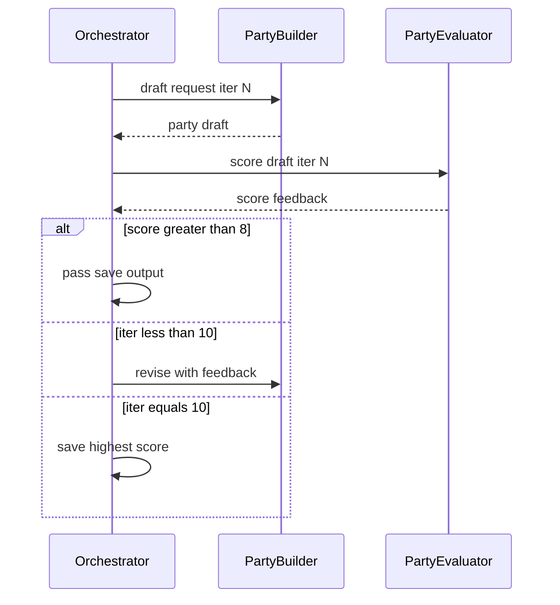
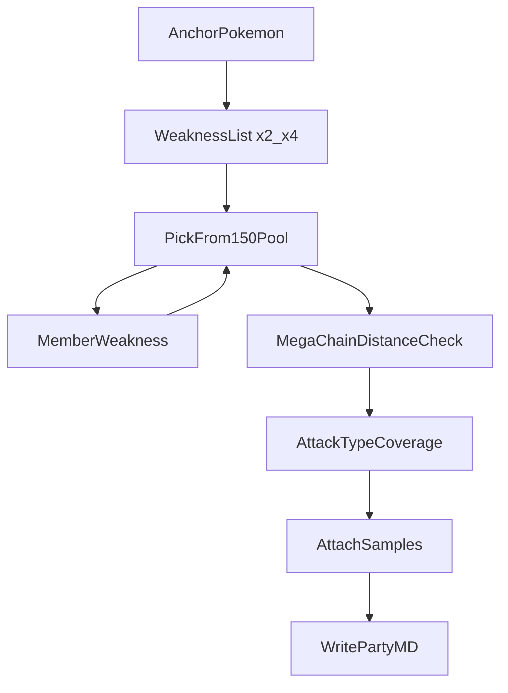

# 포켓몬 파티 편성 통합 스펙

> **이 문서만 읽고** 다른 PC·에이전트가 `/party-main` 파티 편성 시스템을 그대로 재구현할 수 있도록 작성되었다.

**입력:** `/party-main {앵커 포켓몬 이름}`  
**출력:** `wiki/parties/{앵커}-party-main.md` + `wiki/index.md`·`wiki/log.md` 갱신

**필수 데이터:** `wiki/sources/pokemon-party-mega-list.md` (150종 후보 풀)  
**선택 데이터:** `wiki/sources/{이름}-samples.md` (멤버별 빌드)

---

## 1. 빠른 시작

1. 사용자 메시지가 `/party-main`으로 **시작**할 때만 동작한다.
2. **서브에이전트 2명** (구상·평가)을 최대 **10회** 루프한다.
3. **1회차 평가는 7점 미만** 필수. **8점 초과**(9~10점) 시 통과·출력.
4. 10회 미통과 시 **최고점** 파티를 출력한다.
5. 최종안을 `parties/{앵커}-party-main.md`에 저장한다.

관련 명령 (별도 프로토콜):

| 명령 | 용도 |
|------|------|
| `/wiki` | 위키 검색·지식 저장. `/party-main`을 대체하지 않음 |
| `/sample` | 8샘플 이미지 → `sources/*-samples.md` 생성. party-main은 **읽기만** |

---

## 2. 디렉터리·파일 레이아웃

```
llm-wiki/
  docs/
    pokemon-party-composition.md    ← 이 문서 (마스터 스펙)
  wiki/
    concepts/
      pokemon-party-building.md   ← 요약 원칙 (스펙과 동기화)
      pokemon-type-effectiveness.md
    sources/
      pokemon-party-mega-list.md  ← 후보 150종 (필수)
      {이름}-samples.md           ← 빌드 샘플 (선택)
      _sample-template.md
    parties/
      _party-main-template.md     ← 출력 템플릿
      {앵커}-party-main.md        ← 출력 결과
    index.md
    log.md
  .cursor/rules/
    pokemon-party-main.mdc        ← Cursor 규칙 (§10 참고)
```

---

## 3. 명령 프로토콜 (`/party-main`)

### 활성 조건

**사용자 메시지가 `/party-main`으로 시작할 때만** (예: `/party-main 메가리자몽Y`).

- `/wiki`, `/sample`, `@llm-wiki`만으로는 **활성화되지 않음**
- `/party-main` 접두사와 공백을 제거한 문자열 = **앵커 포켓몬 이름**

### 입력

1. **앵커 포켓몬 이름** (필수)
2. 교체 후보, 제외 포켓몬, 역할 지정 등 (선택)

### 읽을 지식 베이스 (순서)

1. 이 문서 (`docs/pokemon-party-composition.md`) 또는 `wiki/concepts/pokemon-party-building.md`
2. 상성표 — 이 문서 §5 또는 `wiki/concepts/pokemon-type-effectiveness.md`
3. `wiki/sources/pokemon-party-mega-list.md`
4. `wiki/sources/{이름}-samples.md` (멤버마다)

### 금지 사항 (Do not)

- `/party-main` 없이 파티 출력·저장
- `sources/*-samples.md`에 없는 빌드 **날조**
- 150종 목록 밖 포켓몬을 **무비고** 제안
- 약점 연쇄에서 메가끼리 **체인 거리 ≤3**
- 선발 3 예시에 **메가 2마리 이상**
- `wiki/parties/` 밖에 저장

### 사용자 응답 형식 (같은 턴)

1. **최종 결과** — 통과 여부, 최종 점수, 사용 회차
2. 파티 표 (역할·타입·보완 대상)
3. 약점 연쇄 요약
4. 멤버별 **추천 빌드 1개** + 샘플 링크
5. **편성·평가 이력** (회차별 점수)
6. **선발 3 예시** (메가 ≤1)
7. 저장 경로

---

## 3b. 이중 서브에이전트 오케스트레이션 (v1.1)

### 역할 분담

| 에이전트 | subagent_type | 입력 | 출력 |
|----------|---------------|------|------|
| **파티 구상** | `generalPurpose` | 앵커, 회차, 이전 피드백 | 6마리 초안 MD |
| **파티 평가** | `generalPurpose` | 초안, 회차, 루브릭 | 점수(10만점), breakdown, 피드백 |

오케스트레이터(본 에이전트)가 Task 도구로 **순차** 호출한다.

### 루프 의사코드

```
MAX_ITER = 10
PASS_THRESHOLD = 8    # score > 8 이면 통과 (9 또는 10)
FIRST_ITER_MAX = 7    # 1회차 score < 7 필수

best = { score: -1, draft: null }
history = []

for i in 1..MAX_ITER:
  draft = call_builder(anchor, feedback=history[-1].feedback if i>1 else null)
  eval = call_evaluator(draft, iteration=i)
  score = eval.score

  if i == 1 and score >= FIRST_ITER_MAX:
    score = 6.5
    eval.feedback += " [1회차 7점 미만 강제]"

  history.append({ i, draft, score, eval.feedback })
  if score > best.score: best = { score, draft }

  if score > PASS_THRESHOLD:
    final = draft
    final_status = "passed"
    break

if final not set:
  final = best.draft
  final_status = "best_of_" + MAX_ITER

write_party_md(final, history, final_status)
```

### 통과·실패 정의

| 조건 | 동작 |
|------|------|
| 어떤 회차든 **점수 > 8** | 그 회차 파티 **통과** → 저장·사용자 출력 |
| 1회차 | 평가 점수 **반드시 7 미만** (≥7이면 6.5로 보정) |
| 10회 후에도 **점수 > 8 없음** | `history` 중 **최고점** 파티 저장 (`final_status: best_of_10`) |

### 구상 에이전트 지시 (프롬프트 템플릿)

```
앵커: {이름}
회차: {N}/10
이전 피드백: {없음 | 평가자 피드백 전문}

docs/pokemon-party-composition.md §4~§7, wiki/sources/pokemon-party-mega-list.md 를 따른다.
150종 풀 안에서만 6마리 선정. 약점 연쇄·메가 규칙·공격 커버·선발3 포함.
2회차 이상이면 피드백의 약점·감점 항목을 우선 수정한다.
```

### 평가 에이전트 지시 (프롬프트 템플릿)

```
회차: {N}/10
앵커: {이름}
제출 파티: {구상 에이전트 출력}

§11 루브릭으로 10점 만점 채점. breakdown + 총점 + 개선 피드백.
회차==1 이면 총점은 반드시 7 미만 (불가피하면 6.5 이하로 보고).
JSON: { "score", "breakdown", "feedback", "passed": score>8 }
```



---

## 4. 게임·파티 규칙 (확정)

### 4.1 핵심 아이디어

- **앵커** 1마리를 중심으로, 앵커가 약한 상성을 **연쇄적으로 메우는** 멤버를 추가한다.
- 동시에 파티 전체의 **공격 기술 타입 커버**가 넓을수록 좋다.

### 4.2 앵커 선정

- 파티의 출발점. 역할·빌드·메가 여부가 이후 멤버 선택의 기준.

### 4.3 방어 상성 연쇄 (약점 보완)

앵커가 **×2 이상** 맞는 공격 타입을 찾고, 그 공격을 덜 받는 포켓몬을 넣는다. 그 멤버의 약점을 다음 멤버가 메운다.

```
앵커의 약점 → 보완 A
A의 약점   → 보완 B
B의 약점   → 보완 C
…
```

| 받는 배율 | 보완 우선순위 |
|-----------|---------------|
| ×4, ×2 | 높음 |
| ×1 | 기본 |
| ×½, ×0 | 저항·면역 (공격 후보) |

복합 타입은 배율 **곱셈**. ×4 약점을 최우선 점검.

### 4.4 공격 타입 커버

- 6마리가 **서로 다른 기술 타입**으로 상대를 칠 수 있는지 확인
- 앵커가 ×0·▲인 타입은 **다른 멤버**가 대신 처리

### 4.5 싱글 배틀 · 메가진화

| 구분 | 규칙 |
|------|------|
| 형식 | 등록 **6마리** → **3마리 선발** |
| 배틀당 메가 | **1회만** 가능 |
| **등록 6** | 메가 **1마리 이상 권장**, **2마리까지** OK |
| **선발 3** | 메가 **최대 1마리** (0도 가능) |

등록 6에 메가 2마리 = 상대별로 A/B 메가를 **골라 쓰는 옵션**. 같은 선발 3에 메가 2마리는 무의미.

### 4.6 약점 연쇄에서 메가 배치

**메가끼리 체인 거리가 3 이하이면 NG.**

체인 순서 `[P0, P1, …, P5]` (P0=앵커)에서, 메가인 두 포켓몬의 인덱스 `i < j`에 대해:

```
체인_거리 = j - i
```

모든 메가 쌍에 **체인_거리 > 3** 이어야 함 (즉 사이에 비메가 보완 **최소 3칸**).

```
✅  앵커(메가) → 일반 → 일반 → 일반 → 메가     거리 4
❌  앵커(메가) → 일반 → 메가                   거리 2
❌  앵커(메가) → 일반 → 일반 → 메가           거리 3
```

메가는 **화력 코어**, 약점 연쇄의 **방패**는 비메가가 담당.

### 처리 흐름



---

## 5. 상성 계산 알고리즘

### 5.1 표기

| 표기 | 배율 |
|------|------|
| ◎ | ×2 |
| (빈칸) | ×1 |
| ▲ | ×½ |
| × | ×0 |

타입명: `불`, `풀`, `물` 등 짧은 표기 (`불꽃` = `불`).

행 = **공격 기술 타입**, 열 = **방어 포켓몬 타입**.

### 5.2 상성표 (18×18)

| 공격＼방어 | 노말 | 불 | 물 | 풀 | 전기 | 얼음 | 격투 | 독 | 땅 | 비행 | 에스퍼 | 벌레 | 바위 | 고스트 | 드래곤 | 악 | 강철 | 페어리 |
|-----------|------|-----|-----|-----|------|------|------|-----|-----|------|--------|------|------|--------|--------|-----|------|--------|
| **노말** | | | | | | | | | | | | | ▲ | × | | | ▲ | |
| **불** | | ▲ | ▲ | ◎ | | ▲ | | | | | | ◎ | ▲ | | ▲ | | ◎ | |
| **물** | | ◎ | ▲ | ▲ | | | | | ◎ | | | | ◎ | | ▲ | | | |
| **풀** | | ▲ | ◎ | ▲ | ▲ | | | ▲ | ◎ | ▲ | | ▲ | ◎ | | ▲ | | ▲ | |
| **전기** | | | ◎ | ▲ | ▲ | | | | × | ◎ | | | | | ▲ | | | |
| **얼음** | | ▲ | ▲ | ◎ | | ▲ | | | ◎ | ◎ | | | | | ◎ | | ▲ | |
| **격투** | ◎ | | | | | ◎ | | ▲ | | ▲ | ▲ | ▲ | ◎ | × | | ◎ | ◎ | ▲ |
| **독** | | | | ◎ | | | | ▲ | ▲ | | | | ▲ | ▲ | | | × | ◎ |
| **땅** | | ◎ | | ▲ | ◎ | | | ◎ | | × | | ▲ | ◎ | | | | ◎ | |
| **비행** | | | | ◎ | ▲ | | ◎ | | | ▲ | | ◎ | ▲ | | | | ▲ | |
| **에스퍼** | | | | | | | ◎ | ◎ | | | ▲ | | | | | × | ▲ | |
| **벌레** | | ▲ | | ◎ | | | ▲ | ▲ | | ▲ | ◎ | ▲ | | ▲ | | ◎ | ▲ | ▲ |
| **바위** | | ◎ | | | | ◎ | ▲ | | ▲ | ◎ | | ◎ | ▲ | | | | ▲ | |
| **고스트** | × | | | | | | | | | | ◎ | | | ◎ | | ▲ | | |
| **드래곤** | | | | | | | | | | | | | | | ◎ | | ▲ | × |
| **악** | | | | | | | ▲ | | | | ◎ | | | ◎ | | ▲ | | ▲ |
| **강철** | | ▲ | ▲ | | ▲ | ◎ | | | | | | | ◎ | | | | ▲ | ◎ |
| **페어리** | | ▲ | | | | | ◎ | ▲ | | | | | | | ◎ | ◎ | ▲ | |

### 5.3 배율 조회 (구현)

```
function multiplier(attackType, defendType):
  cell = CHART[attackType][defendType]
  if cell == "◎": return 2
  if cell == "▲": return 0.5
  if cell == "×": return 0
  return 1

function defendingMultiplier(attackType, pokemonTypes):
  m = 1
  for t in pokemonTypes:
    m *= multiplier(attackType, t)
  return m
```

### 5.4 약점·저항 목록 추출

18개 공격 타입 각각에 `defendingMultiplier` 계산:

- **약점:** 결과 ≥ 2. ×4 먼저, ×2 다음 정렬
- **저항·면역:** 결과 ≤ 0.5 (0 = 면역)

### 5.5 타입 고유 면역 (방어 보완 참고)

| 타입 | 효과 |
|------|------|
| 불 | 화상 면역 |
| 풀 | 씨뿌리기·독가루·저리가루·수면가루·버섯포자 면역 |
| 전기 | 마비 면역 |
| 얼음 | 얼음 상태·싸라기눈 면역 |
| 독 | 독/맹독 면역, 출장 시 독압정 제거 (비행·부유 제외) |
| 땅 | 전기자석파·모래바람 면역 |
| 비행 | 압정뿌리기·독압정 면역 |
| 바위 | 모래바람 면역, 모래바람 중 특수방어 상승 |
| 고스트 | 도주 불가 기술 면역 |
| 강철 | 모래바람·독/맹독 면역 (독압정 포함) |

---

## 6. 후보 풀 (`pokemon-party-mega-list.md`)

### 6.1 컬럼 (Google Sheets 원본)

| 컬럼 | 의미 |
|------|------|
| A | 포켓몬 이름 |
| B = `0` | 6마리 파티용 |
| B = `1` | 1인 슬롯 (대부분 메가) |
| C | 1타입 |
| D | 2타입 (비면 단일) |

타입 표기: `드래곤/땅` (복합), `땅` (단일).

### 6.2 메가 판별

- 이름이 `메가`로 시작 → 메가진화 포켓몬
- B=1 예외 (메가 아님): `플라엣테 (영원의 꽃)`

### 6.3 파티 6 구성 규칙

- **앵커 1 + 멤버 5 = 6마리**
- 멤버는 **반드시 150종 목록 안**에서만 선택
- 목록 밖 제안 시 명시적으로 "풀 외" 표기

### 6.4 앵커 유형별

| 앵커 | 등록 6 구성 예 |
|------|----------------|
| 메가 (B=1) | 메가 앵커 + 비메가 5 |
| 비메가 (B=0) | 비메가 앵커 + 멤버 4 + 메가 0~2 |

---

## 7. 처리 파이프라인

### 7a. 오케스트레이션 (서브에이전트 루프)

| # | 단계 | 담당 | 출력 |
|---|------|------|------|
| 0 | 앵커 해석 | 오케스트레이터 | 타입, B슬롯 |
| 1~10 | 구상 → 평가 반복 | Builder → Evaluator | 회차별 draft, score |
| — | 통과 판정 | 오케스트레이터 | score>8 또는 best_of_10 |

### 7b. 최종안 정리 (9단계)

| # | 단계 | 입력 | 출력 | 실패 시 |
|---|------|------|------|---------|
| 1 | 앵커 해석 | 이름 | 타입, B슬롯, 메가 여부 | 목록에서 검색 실패 → 사용자에게 확인 |
| 2 | 약점·저항 | 앵커 타입 | ×4/×2 표, 저항 목록 | — |
| 3 | 6마리 선정 | 150종 풀 | 6마리 + 역할 | 풀 밖 사용 금지 |
| 4 | 메가 수량 | 등록 6, 선발 3 | 등록: 1+권장 2까지 / 선발: ≤1 | 선발 3에 메가 2+ → 재선정 |
| 5 | 약점 연쇄 | 6마리 순서 | 연쇄 다이어그램 + 메가 거리 검증 | 거리 ≤3 → 멤버 재배치 |
| 6 | 공격 커버 | 샘플·타입 | 타입→담당 표 | 빈 타입 → 교체 후보 기록 |
| 7 | 샘플 조회 | `*-samples.md` | 빌드 목록 | 없으면 `샘플 없음 — /sample 수집 필요` |
| 8 | 추천 빌드 | 빌드 목록 + 역할 | 멤버당 1개 | — |
| 9 | 선발 3 | 등록 6 | 3마리 예시 (메가 ≤1) | — |
| 10 | 평가 이력 | 루프 기록 | `## 편성·평가 이력` 표 | — |

검증 실패(5·4) 시 **구상 에이전트 재호출**. 루프 내에서는 **평가 피드백**으로 수정.

### 메가 체인 거리 검증 (의사코드)

```
chain = [P0..P5]  # P0 = anchor
mega_indices = [i for i, p in enumerate(chain) if is_mega(p.name)]

for each pair (i, j) in mega_indices where i < j:
  if j - i <= 3:
    FAIL "메가 체인 거리 위반"

PASS
```

### 선발 3 검증

```
bring3 = subset of 6, size 3
count_mega(bring3) must be <= 1
```

---

## 8. 출력 스키마

**경로:** `wiki/parties/{앵커}-party-main.md`  
**템플릿:** `wiki/parties/_party-main-template.md`

### Frontmatter

```yaml
---
title: "{앵커} 파티"
kind: party-main
anchor: "{앵커}"
party_size: 6
updated: YYYY-MM-DD
tags: [pokemon, party-main]
evaluation:
  iterations: {N}
  final_score: {점수}
  final_status: passed | best_of_10
  pass_threshold: ">8"
  selected_iteration: {통과 또는 최고점 회차}
related_concepts:
  - concepts/pokemon-party-building.md
  - concepts/pokemon-type-effectiveness.md
sources_pool: sources/pokemon-party-mega-list.md
---
```

### 필수 섹션 (9개)

1. `## 파티 구성`
2. `## 앵커 약점`
3. `## 약점 연쇄`
4. `## 공격 타입 커버`
5. `## 멤버별 샘플`
6. `## 편성·평가 이력` — 회차별 점수·통과여부·피드백 요약
7. `## 선발 3 예시`
8. `## 교체 후보 (선택)`

### 멤버별 샘플 형식

```markdown
### {포켓몬명} — {타입} · {역할}

- **보완:** {어떤 약점/위협}
- **샘플:** [sources/{slug}-samples.md](../sources/{slug}-samples.md) ({N}빌드)
- **추천 빌드:** {도구} · {특성} · {성격} — {기술 4개}
- **전체 빌드:**
  - 빌드 1 — …
```

샘플 없음:

```markdown
- **샘플:** **샘플 없음** — `/sample` 수집 필요
```

### 저장 후 유지보수

1. `wiki/index.md` → `## 파티 (parties/)` 에 링크 추가
2. `wiki/log.md` → `## [YYYY-MM-DD] party-main | {앵커} → parties/{file}`

---

## 9. 샘플 파일 읽기 규약

`/sample` 수집 프로토콜 전체가 아니라 **party-main이 읽는 부분만**.

| 항목 | 값 |
|------|-----|
| 경로 | `wiki/sources/{이름}-samples.md` |
| frontmatter | `pokemon_name`, `build_count` |
| 인용 섹션 | `## 정리된 빌드` → 각 `### 빌드 N` |
| 메가 앵커 | `메가{이름}-samples.md` 우선 |
| 지역 폼 | `윈디-히스이-samples.md` 등 slug 그대로 |

빌드 블록에서 추출할 필드:

- `도구 / 특성 / 성격`
- `능력치 분배`
- `고정 기술` (및 `후보 기술` 있으면 요약)

**금지:** `## 원본 샘플`을 빌드로 날조하거나, 파일에 없는 기술·도구를 적지 않는다.

---

## 11. 평가 루브릭 (10점 만점)

평가 서브에이전트가 매 회차 적용한다. 항목별 합계 = **총점** (소수 1자리 허용).

| # | 항목 | 만점 | 기준 |
|---|------|------|------|
| 1 | 앵커 약점 보완 | 2.0 | ×4·×2 위협마다 연쇄상 흡수·저항 멤버 있는가 |
| 2 | 약점 연쇄 완결성 | 2.0 | A→B→C 연쇄가 끊기지 않는가, 구멍 타입 없는가 |
| 3 | 메가·싱글 규칙 | 1.0 | 등록6 메가 1~2, 선발3 메가≤1, 체인 거리>3 |
| 4 | 공격 타입 커버 | 2.0 | 주요 타입(18 중 12+) 커버, 앵커 사각 대체 |
| 5 | 파티 상관 약점 | 1.0 | 3마리 이상 동시에 무너지는 공통 약점 없는가 |
| 6 | 150종 풀 준수 | 0.5 | 목록 밖 포켓몬 없음 |
| 7 | 샘플·빌드 인용 | 0.5 | 날조 없음, 역할에 맞는 추천 빌드 |
| 8 | 선발 3 실전성 | 1.0 | 앵커+핵심 보완, 메가 규칙 준수 |

**감점 예:** 메가 체인 거리 ≤3 → 항목3에서 -0.5, 공통 ×4 약점 → 항목5에서 -1.0

**1회차 특수 규칙:** 총점 산출 후 **≥7.0이면 6.5 이하로 보정**하고 피드백에 `[1회차 7점 미만 강제]` 기록.

**통과:** 총점 **> 8.0** (9.0 또는 10.0).

### 편성·평가 이력 표 형식

```markdown
## 편성·평가 이력

**최종:** {passed | best_of_10} · **선택 회차** {k} · **점수** {score}/10

| 회차 | 점수 | 통과 | 요약 피드백 |
|------|------|------|-------------|
| 1 | 6.5 | | … |
| 2 | 7.5 | | … |
| 3 | 8.5 | ✓ | … |
```

---

## 10. Cursor 규칙 복제 · 정답 예시

### 10.1 `.cursor/rules/pokemon-party-main.mdc` 생성

```yaml
---
description: Pokémon party builder — only when user message starts with /party-main
globs:
  - llm-wiki/**
---
```

본문은 이 문서 **§3** + **§7** + **§8** + 금지 사항을 그대로 옮긴다.  
또는 저장소의 `pokemon-party-main.mdc`를 복사한다.

### 10.2 정답 예시 (참조용)

| 앵커 유형 | 파일 | 요점 |
|-----------|------|------|
| 메가 앵커 | `wiki/parties/메가리자몽Y-party-main.md` | 메가 1, 체인에 메가 1, 바위×4 보완 |
| 비메가 앵커 | `wiki/parties/대쓰여너-party-main.md` | 등록 6에 메가갸라도스 1, 선발 3 분리 |

새 파티 작성 시 위 파일과 **동일한 섹션 구조·깊이**를 따른다.

### 10.3 선발 3 예시 작성 가이드

- 등록 6 중 **가장 자주보낼 3마리** (앵커 + 화력/보완 핵심)
- **메가 0 또는 1마리**
- 한 줄씩 선발 이유 (예: "앵커 화력 + 전기 벽 + 격투 커버")

---

## 부록: 검증 체크리스트

구현·출력 전 최종 확인:

- [ ] 앵커가 `pokemon-party-mega-list.md`에 존재
- [ ] 6마리 모두 150종 풀 안
- [ ] 등록 6: 메가 0~2 (1+ 권장)
- [ ] 선발 3 예시: 메가 ≤1
- [ ] 메가 쌍 체인 거리 모두 > 3
- [ ] ×4 약점마다 연쇄상 보완 멤버 존재
- [ ] 공격 타입 커버 표 작성
- [ ] 샘플은 `정리된 빌드`만 인용
- [ ] `index.md`·`log.md` 갱신
- [ ] 서브에이전트 루프 실행 (최대 10회)
- [ ] 1회차 점수 < 7
- [ ] `## 편성·평가 이력` 기록

---

## 12. Party Viewer Web UI

브라우저 3열 파티 뷰어 + MCP·HTTP 백엔드 (`mcp/party-viewer`, `web/party-viewer`).

### 12.1 실행

```bash
# llm-wiki 루트
cp .env.example .env   # GOOGLE_API_KEY 등 생성용 키 설정
npm install
npm run party:dev      # API :3847 + 웹 :5173
```

| 스크립트 | 설명 |
|----------|------|
| `party:server` | HTTP API (`localhost:3847`) |
| `party:web` | Vite React UI (`localhost:5173`) |
| `party:mcp` | MCP stdio 서버 (Cursor IDE) |
| `party:dev` | 서버 + 웹 동시 실행 |

### 12.2 UI 레이아웃

| 열 | 컴포넌트 | 역할 |
|----|----------|------|
| 왼쪽 (240px) | PartySidebar | `manifest.json` 파티 목록, 점수·날짜, 동기화 |
| 가운데 | PartyDetail | 구성·약점·연쇄·커버·평가·선발3·빌드 |
| 오른쪽 (360px) | ChatPanel | AI 선택 + **상단 API 키 붙여넣기·연동** + 파티 생성 (SSE) |

웹 UI에서 API 키를 붙여넣으면 서버 메모리에 저장되어 즉시 생성 가능합니다 (`.env` 수정 불필요). **서버 재시작 시 키는 초기화**됩니다. `.env` 키는 fallback으로 계속 동작합니다.

### 12.3 HTTP API

| Method | Path | 동작 |
|--------|------|------|
| GET | `/api/health` | 사용 가능 프로바이더·기본값·루프 횟수 |
| GET | `/api/parties` | 목록 |
| GET | `/api/parties/:slug` | 상세 JSON |
| POST | `/api/parties/sync` | manifest 재스캔 |
| POST | `/api/parties/generate` | `{ anchor, provider? }` → 생성 |
| POST | `/api/providers/key` | `{ provider, apiKey }` → 런타임 키 연동 |
| DELETE | `/api/providers/key/:provider` | 런타임 키 삭제 |
| GET | `/api/parties/generate/:jobId/stream` | SSE 진행 메시지 |

**생성 프로바이더** (`PARTY_GENERATE_PROVIDER` 또는 요청 body `provider`):

| provider | 환경변수 | 동작 |
|----------|----------|------|
| `cursor` | `CURSOR_API_KEY` | Cursor SDK `Agent.prompt` (IDE급 에이전트) |
| `anthropic` | `ANTHROPIC_API_KEY` | Claude API + Node 3회 구상·평가 루프 |
| `google` | `GOOGLE_API_KEY` | Gemini API + Node 3회 루프 |
| `openai` | `OPENAI_API_KEY` | OpenAI API + Node 3회 루프 |

비-Cursor 경로: `PARTY_MAX_ITERATIONS=3` (기본), 1회차 &lt;7 강제, &gt;8 통과, 미통과 시 최고점 저장. 목록·조회는 API 키 없이 동작.

### 12.4 MCP 도구 (`.cursor/mcp.json`)

| Tool | 설명 |
|------|------|
| `party_list` | manifest 요약 목록 |
| `party_get` | slug → PartyRecord JSON |
| `party_sync` | MD 스캔 후 manifest 갱신 |
| `party_open_in_viewer` | `http://localhost:5173?party={slug}` 힌트 |

### 12.5 데이터

- 파티 MD: `wiki/parties/*-party-main.md`
- 인덱스: `wiki/parties/manifest.json`
- 파서: `mcp/party-viewer/src/core/parse-party.ts` (`PartyRecord`)

### 12.6 이식용 마스터 문서

다른 PC·Gemini·에이전트가 **동일 뷰어를 재구현**할 때: [docs/party-viewer-implementation.md](./party-viewer-implementation.md) (본 문서 §12는 요약, 해당 문서가 전체 스펙).

---

## 변경 이력

| 날짜 | 내용 |
|------|------|
| 2026-06-14 | v1.0 초안 — party-main 통합 스펙 |
| 2026-06-14 | v1.1 — 이중 서브에이전트(구상·평가) 루프, 10점 루브릭, 1회차<7 / 통과>8 |
| 2026-06-14 | v1.2 — Party Viewer Web UI + MCP (`mcp/party-viewer`, `web/party-viewer`) |
| 2026-06-14 | v1.3 — 멀티 프로바이더 생성 (Gemini/Claude/OpenAI/Cursor), 3회 루프 |
