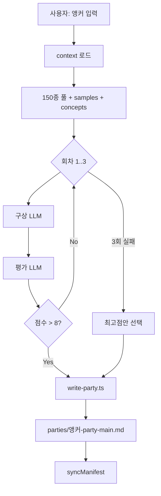

# Party Viewer + LLM Wiki — 제품 요구사항 문서 (PRD)

## 1. 개요

### 1.1 문제

포켓몬 싱글·메가 파티 편성은 **상성·메가 규칙·실전 빌드**를 동시에 고려해야 한다.  
대화만으로 파티를 만들면 **출처 불명·재현 불가·규칙 위반**이 잦다.

### 1.2 목표 (Goals)

| # | 목표 | 측정 |
|---|------|------|
| G1 | 앵커 기준 파티를 **규칙 준수**하며 생성 | 평가 루브릭 8점+ 통과율 |
| G2 | 모든 빌드·후보에 **wiki 출처** 연결 | samples MD 링크 100% |
| G3 | 파티 목록·상세를 **웹 UI**로 조회 | 3열 UI, manifest 동기화 |
| G4 | Cursor 등 에이전트가 **MCP**로 파티 조회 | 4개 tool 정상 응답 |
| G5 | Gemini/Claude/OpenAI/Cursor 중 **선택 생성** | 프로바이더 전환·3회 루프 |

### 1.3 비목표 (Non-Goals)

- 온라인 대전·랭크 시뮬레이션
- 포켓몬 전역 백과사전
- 클라우드 호스팅·멀티유저 인증
- API 키 영구 저장 (런타임 메모리만)

---

## 2. 사용자·페르소나

| 페르소나 | 니즈 |
|----------|------|
| **파티 연구자** | 메가리자몽Y 기준 약점 연쇄 파티를 보고 비교 |
| **Cursor 사용자** | `/party-main` 또는 MCP로 생성·조회 |
| **멀티 LLM 사용자** | 웹에서 API 키 붙여넣고 Gemini 등으로 생성 |
| **이관 담당자** | MD + docs만으로 다른 PC에서 동일 시스템 재구축 |

---

## 3. 기능 요구사항

### 3.1 LLM Wiki (지식 베이스)

| ID | 요구사항 | 우선순위 | 상태 |
|----|----------|----------|------|
| W-1 | `sources/`에 150종 후보 풀 유지 | P0 | ✅ |
| W-2 | `/sample`로 포켓몬별 8샘플 MD 생성 | P0 | ✅ |
| W-3 | `concepts/`에 상성·편성 원칙 | P0 | ✅ |
| W-4 | `/party-main` 출력 MD 스키마 (`_party-main-template`) | P0 | ✅ |
| W-5 | `wiki_query.py` 로컬 검색 | P1 | ✅ |
| W-6 | `wiki/log.md` 변경 추적 | P1 | ✅ |

### 3.2 Party Viewer Web

| ID | 요구사항 | 우선순위 | 상태 |
|----|----------|----------|------|
| V-1 | 3열 레이아웃 (목록·상세·채팅) | P0 | ✅ |
| V-2 | manifest 기반 파티 목록 (점수·날짜) | P0 | ✅ |
| V-3 | 파티 상세: 구성·약점·연쇄·커버·평가·선발3·빌드 | P0 | ✅ |
| V-4 | 동기화 버튼 → `POST /api/parties/sync` | P0 | ✅ |
| V-5 | 프로바이더 선택 + API 키 입력 (메모리) | P0 | ✅ |
| V-6 | 파티 생성 3회 구상·평가 루프 | P0 | ✅ |
| V-7 | 생성 진행 스트림/SSE | P1 | ✅ |

### 3.3 HTTP API (`:3847`)

| 메서드 | 경로 | 설명 |
|--------|------|------|
| GET | `/api/health` | 헬스체크 |
| GET | `/api/parties` | 목록 |
| GET | `/api/parties/:slug` | 상세 |
| POST | `/api/parties/sync` | manifest 갱신 |
| POST | `/api/parties/generate` | 생성 job 시작 |
| GET | `/api/parties/generate/:jobId` | job 상태 |
| GET | `/api/parties/generate/:jobId/stream` | SSE 진행 |
| POST | `/api/providers/key` | 런타임 API 키 설정 |
| DELETE | `/api/providers/key/:provider` | 키 제거 |

### 3.4 MCP (`party-viewer`)

| Tool | 입력 | 출력 |
|------|------|------|
| `party_list` | — | manifest 기반 목록 JSON |
| `party_get` | `slug` | 파티 상세 JSON |
| `party_sync` | — | 스캔 후 manifest 갱신 |
| `party_open_in_viewer` | `slug` | `http://localhost:5173?party=…` URL |

---

## 4. 파티 생성 파이프라인 (요구 스펙)



**입력 컨텍스트:**

- `wiki/sources/pokemon-party-mega-list.md`
- `wiki/concepts/pokemon-party-building.md`
- `wiki/concepts/pokemon-type-effectiveness.md`
- `wiki/sources/{멤버}-samples.md` (있을 때)

**출력 필수 섹션:**

- 파티 구성, 앵커 약점, 약점 연쇄, 공격 타입 커버
- 편성·평가 이력, 선발 3 예시, 멤버별 샘플, 교체 후보

**검증 규칙 (Do not):**

- 150종 밖 포켓몬 무비고
- samples 없는 빌드 날조
- 메가 체인 거리 ≤3 위반
- 선발3 메가 2마리 이상

---

## 5. 데이터 모델

### 5.1 Party MD frontmatter

```yaml
---
title: "메가리자몽Y 파티"
kind: party-main
anchor: 메가리자몽Y
updated: "2026-06-14"   # 따옴표 필수
---
```

### 5.2 `manifest.json` 항목

```json
{
  "slug": "메가리자몽Y",
  "anchor": "메가리자몽Y",
  "file": "메가리자몽Y-party-main.md",
  "updated": "2026-06-14",
  "finalScore": 9.0,
  "finalStatus": "통과"
}
```

---

## 6. 비기능 요구사항

| 항목 | 요구 |
|------|------|
| **로컬 우선** | Node 18+, 단일 PC에서 server+web 실행 |
| **이식성** | `docs/*.md`만으로 재구현 가능 |
| **보안** | API 키는 프로세스 메모리, git 미커밋 |
| **Windows** | PowerShell 실행 정책 시 `npm.cmd` 사용 |
| **의존성** | 루트 `package.json` 단일 워크스페이스 |

---

## 7. 성공 기준 (Acceptance)

- [x] `npm run party:dev` 후 http://localhost:5173 에서 3개 파티 목록 표시
- [x] `party_sync` MCP 호출 시 `localeCompare` 오류 없음
- [x] 새 파티 생성 시 `updated`가 quoted string
- [x] Gemini 키를 웹 UI에 붙여넣으면 생성 요청 가능 (quota는 외부 요인)
- [x] `party_get`으로 메가리자몽X JSON 상세 반환

---

## 8. 마일스톤 (실제 진행)

| 날짜 | 마일스톤 |
|------|----------|
| 2026-06-14 | Wiki ingest·sample 90+종 |
| 2026-06-14 | concepts·party-main 프로토콜 |
| 2026-06-14 | pokemon-party-composition v1.1 |
| 2026-06-14 | Party Viewer Web + MCP |
| 2026-06-14 | 멀티 프로바이더·런타임 키 |
| 2026-06-14 | manifest updated 정규화 버그픽스 |

---

## 9. 구현 참조 (상세 스펙)

본 PRD는 **무엇을·왜**에 집중한다. **어떻게**는 아래 문서를 따른다.

- [pokemon-party-composition.md](./pokemon-party-composition.md) — `/party-main` 생성 로직
- [party-viewer-implementation.md](./party-viewer-implementation.md) — Web·API·MCP·UI
- [wiki-domain.md](./wiki-domain.md) — 도메인 경계
- [journal.md](./journal.md) — 의사결정 이력
